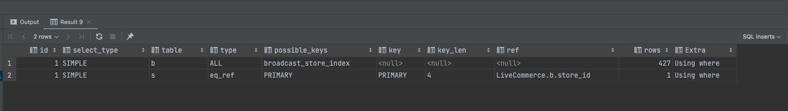

### SQL과 옵티마이저

---

sql은 구조적이고 집합적이고 선언적인 질의 언어입니다.

⇒ 선언을 해서 결과를 받아오는데 이 과정에서 쿼리를 최적으로 실행하기 위해 각 테이블의 데이터가 어떤 분포로 저장돼 있는지를 참조하고, 데이터를 기반으로 최적의 실행계획을 수립해주는 것이 옵티마이저입니다.

### SQL 최적화 과정 세분화

---

1. SQL 파싱 - sql 파서가 파싱을 진행합니다.
    1. 파싱 트리 생성 - sql문을 이루는 개별 구성요소를 분석해서 파싱 트리를 생성
    2. Syntax 체크 - 문법적 오류가 없는지를 확인
    3. semantic 체크 - 의미상 오류가 없는지 체크
2. sql 최적화 - 옵티마이저가 역할을 맡음
    1. 다양한 실행경로를 생성해서 비교한 후 가장 효율적인 하나를 선택합니다. - DB 성능의 핵심
3. 로우 소스 생성
    1. sql 옵티마이저가 선택한 실행경로를 실제 실행 가능한 코드 또는 프로시저 형태로 포맷팅하는 단계

### SQL 옵티마이저

---

효율적으로 수행할 수 있는 최적의 데이터 엑세스 경로를 선택해 주는 DBMS의 핵심 엔진

1. 쿼리를 실행하는 데 후보군이 될만한 실행계획들을 찾음
2. 오브젝트 통계 및 시스템 통계정보를 이용해 각 실행계획의 예상비용을 산정
3. 최저 비용을 나타내는 실행계획을 선택

### 실행계획과 비용

---

실행계획이란 옵티마이저가 생성한 처리절차를 사용자가 확인할 수 있게 나타난 것

```sql
// 오라클에서 플랜
set autotrace traceonly exp;

select * from category;
```

```sql
explain
select * from LiveCommerceJpa.category
```

옵티마이저가 특정 실행계획을 선택하는 근거는?



```sql
explain
select * from
broadcast b
left outer join store s on b.store_id = s.id
where b.store_id = 7;
```

### 옵티마이저 힌트

---

통계정보에 담을 수 없는 데이터 또는 업무 특성을 활용해 개발자가 직접 더 효율적인 액세스 경로를 찾기위해 사용

MYSQL에는 1. 인덱스 힌트와 2. 옵티마이저 힌트가 있습니다.

**인덱스 힌트**

```sql
// 테이블이 조인되는 경우 조인 순서를 고정하는 역할
SELECT /*! STRAIGHT_JOIN */
    *
FROM account a, store s
WHERE a.store_id=s.id

// use index, force index ignore index
SELECT /*+ USE INDEX(index_name) */
    *
FROM account a, store s
WHERE a.store_id=s.id
```

- 출처

  [https://jjingho.tistory.com/m/173](https://jjingho.tistory.com/m/173)

  [https://velog.io/@bae_mung/TIL-MySQL-Hint](https://velog.io/@bae_mung/TIL-MySQL-Hint)


**힌트를 쓸거면, 빈틈없이 기술해야한다.**