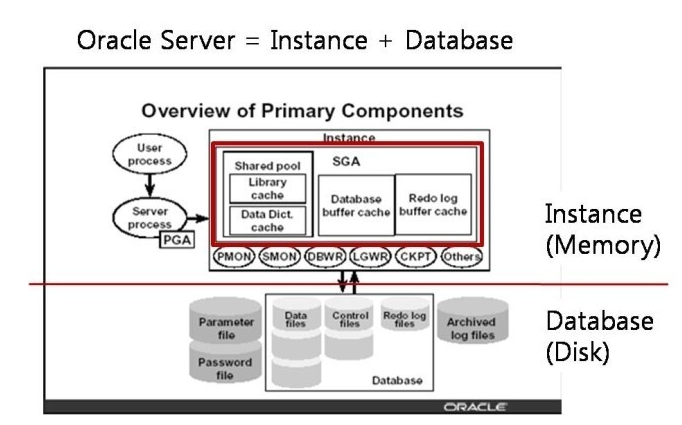
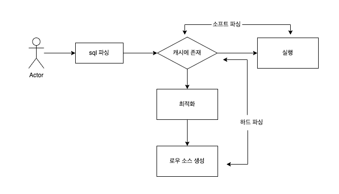

## 소프트 파싱 vs 하드 파싱

---

SGA(system global area)란?(오라클에서)

- 출처 및 참고 블로그

  [https://one-zero.tistory.com/entry/Oracle-SGASystem-Global-Area](https://one-zero.tistory.com/entry/Oracle-SGASystem-Global-Area)
  [https://goddaehee.tistory.com/64](https://goddaehee.tistory.com/64)
  [https://owlyr.tistory.com/23](https://owlyr.tistory.com/23)






1. 먼저 라이브러리 캐시에 존재하는지 확인
2. 존재하면 실행 단계로 넘어감 (소프트 파싱)
3. 존재하지 않으면 최적화 (하드 파싱) ⇒ 하드라고 하는 이유는 최적화 자체가 매우 무겁고 복잡하기 때문에

Buffer Pool(oracle 의 sga와 비슷한 개념)

- 버퍼 풀은 InnoDB가 액세스 할 때 테이블 및 인덱스 데이터를 캐시하는 메인 메모리 영역

### 바인드 변수의 중요성

```sql
# 프로시저, 트리거, 패키지 등은 이름이 있다. => A
create procedure A() {}

# sql은 텍스트가 이름 역할
select * from store
SELECT * from store
```

파라미터 Driven 방식으로 SQL을 작성하는 방법이 제공되는데, 바인드 변수를 사용하면 된다.

- 만약 프로그램을 “SELECT * FROM CUSTOMER WHERE LOGIN_ID = ‘” + login_id + “’” 이렇게 적었다면?

  SELECT * FROM CUSTOMER WHERE LOGIN_ID = ‘A’
  SELECT * FROM CUSTOMER WHERE LOGIN_ID = ‘B’
  …
  모든 sql을 라이브러리 캐시에 저장하고 재사용하지 못함

- 만약 프로그램을 “SELECT * FROM CUSTOMER WHERE LOGIN_ID = ?” 라고 적었다면?


    SELECT * FROM CUSTOMER WHERE LOGIN_ID = :1
    하드 파싱은 1번만 일어나고 캐싱된 SQL 재사용


JPA에서는 아래처럼 제공된다.

SELECT m FROM Member m WHERE m.username = ?0 (위치 기반)

SELECT m FROM Membeer m WHERE m.username = :name (이름 기반)

```sql
@Query(”select s from store s where [s.id](http://s.id) = :storeId”)
```

즉 기본적으로 바인딩을 제공한다.