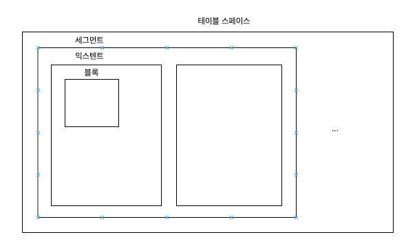
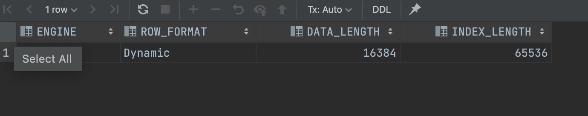

### SQL이 느린 이유

---

결론은 I/O 때문이다.

프로그램 즉 여러 프로세스가 하나의 cpu를 공유하고 특정 순간에는 하나의 프로세스만 cpu를 사용하기 때문에 준비시간이 필요하다. ⇒ I/O콜이 많아지면 디스크 경합이 많아지고 대기시간이 늘어나고 성능이 느릴수밖에 없다.

### 데이터 저장 구조

---



테이블 스페이스 - 세그먼트 - 익스텐트 - 블록 - 그안에 로우들이 있다.

**세그먼트**

세그먼트는 테이블, 인덱스처럼 데이터 저장공한이 필요한 오브젝트

**익스텐트**

공간을 확장하는 단위

**블록(mysql 에서는 page)**

사용자가 입력한 레코드를 실제로 저장하는 공간

```sql
// oracle
select segment_type, tablespace_name, extent_id, file_id, block_id, blocks
from dba_extents
where owner = USER
and segment_name = 'MY_SEGMENT'
order by extent_id;

// mysql
SELECT table_name, data_length, index_length
FROM information_schema.tables
WHERE table_schema = 'LiveCommerceJpa'
AND table_name = 'broadcast';
```



### 블록 단위 I/O

DBMS가 데이터를 읽고 쓰는 단위는 블록이다. ⇒ 인덱스, 테이블 도 블록 단위로 데이터를 읽고 쓴다.

레코드 하나를 읽고 싶어도 해당 블록을 통째로 읽는다.

**시퀄셜 액세스**

논리적 또는 물리적으로 연결된 순서에 따라 차례대로 블록을 읽는 방식(앞뒤를 가리키는 주소값으로 읽는다.)

오라클에서는 세그먼트 헤더에 맵으로 익스텐트들을 가지고 있다. 즉 세그먼트의 맵에서 각 익스텐트들을 순차적으로 읽는다. ⇒ 이것이 full table scan

**랜덤 액세스**

순서를 따르지 않고 레코드 하나를 읽기 위해 한 블록씩 접근하는 방식

### 논리적 I/O - 물리적 I/O

**DB버퍼 캐시**

db 버퍼 캐시는 데이터 캐시로 디스크에서 읽은 데이터 블록을 캐싱해 둔다.
만약 db 버퍼 캐시가 없다면 자주 읽는 블록을 매번 디스크에서 읽으므로 매우 비효율적이다. 그래서 SQL을 실행하면 먼저 DB 버퍼 캐시를 먼저 읽어서 있으면 사용하고 없으면 디스크에서 읽은 후에 캐시에 저장한다.

논리적 I/O(메모리 I/O) - sql 과정에서 발생한 총 블록 I/O (여러번 실행을 해도 매번 읽는 수는 같다.)

물리적 I/O - 디스크에서 발생한 총 블록 I/O (버퍼 캐시에서 찾지 못해 디스크에서 읽은 블록 I/O)

**버퍼캐시 히트율**

BCHR = (캐시에서 찾은 블록수 / 총 읽은 블록수 ) * 100

            = (논리적 - 물리적 / 논리적 ) * 100

            = (1 - 물리적 / 논리적 ) * 100

결론은 sql 성능을 향상하려면 논리적 I/O를 줄여야한다.

**논리적 IO를 줄이려면?**

총 블록 개수를 줄이면 된다.

mysql 에서 수집한 call 통계 정보는?

<aside>
💡 BCHR이 SQL 성능을 좌우하지만 BCHR이 높다고 해서 효율적인 SQL을 의미하지는 않는다.

</aside>

### single block I/O, multiblock I/O

single block I/O

- 한번에 한 블록씩 요청해서 메모리에 적재하는 방식
- 인덱스와 테이블이 사용

multi block I/O

- 캐시에서 찾지 못한 특정 블록을 읽기 위해서 I/O 콜을 하는데 디스크 상에 블록과 인접한 블록들을 (여러 블록씩 )요청해서 메모리에 적재하는 방식
- full table scan이 사용 (multi block I/O 단위를 크게 할 수록 좋음)

<aside>
💡 multiblock I/O 중간에 single I/O가 나타나는 이유?
블록 목록: [1, 2, 3, 4, 5, 6, 7]
캐시에 저장: [1, 6]
⇒ 2, 3, 4, 5를 가져오는데 multi block I/O
⇒ 7 가져오는데 single block I/O

</aside>

### table full scan vs index range scan

**table full scan**

- 블록 전체를 읽는다.
- 시퀄셜 액세스
- multiblock I/O
- 스토리지 스캔 성능이 좋아지는 만큼 좋아진다.

⇒ 한번의 I/O를 통해서 한꺼번에 가져옴. 소량의 데이터를 찾을 때는 비효율적이다.

**index range scan**

- 인덱스에서 일정량 스캔해서 읽는다.
- 랜덤 액세스
- single block I/O

⇒ 레코드 하나를 읽기 위해 매번 I/O를 통해서 가져옴, 대량의 데이터를 찾을 때 비효율적

<aside>
💡 인덱스가 성능을 떨어뜨리는 경우도 있다.
예를 들어서 배치프로그램이 있다.

</aside>