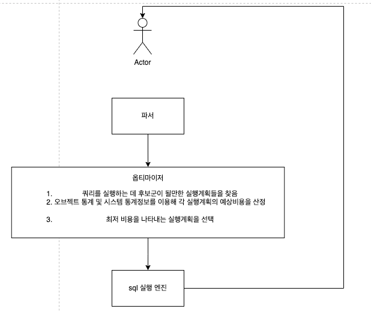

### SQL과 옵티마이저

---

sql은 구조적이고 집합적이고 선언적인 질의 언어입니다.

⇒ 선언을 해서 결과를 받아오는데 이 과정에서 쿼리를 최적으로 실행하기 위해 각 테이블의 데이터가 어떤 분포로 저장돼 있는지를 참조하고, 데이터를 기반으로 최적의 실행계획을 수립해주는 것이 옵티마이저입니다.

컴퓨터의 두뇌 - cpu, DBMS의 두뇌 - 옵티마이저



1. 먼저 파싱을 함
2. sql 최적화를함
3. 로우 소스 생성해서 sql 실행을 함

### 실행계획과 비용

---

실행계획이란 옵티마이저가 생성한 처리절차를 사용자가 확인할 수 있게 나타난 것

```sql
// 오라클에서 플랜
set autotrace traceonly exp;

select * from category;
```

```sql
explain
select * from LiveCommerceJpa.category
```

옵티마이저가 특정 실행계획을 선택하는 근거는?


```sql
explain
select * from
broadcast b
left outer join store s on b.store_id = s.id
where b.store_id = 7;
```

### 옵티마이저 힌트

---

통계정보에 담을 수 없는 데이터 또는 업무 특성을 활용해 개발자가 직접 더 효율적인 액세스 경로를 찾기위해 사용

MYSQL에는 1. 인덱스 힌트와 2. 옵티마이저 힌트가 있습니다.

**인덱스 힌트**

```sql
// 테이블이 조인되는 경우 조인 순서를 고정하는 역할
SELECT /*! STRAIGHT_JOIN */
    *
FROM account a, store s
WHERE a.store_id=s.id

// use index, force index ignore index
SELECT /*+ USE INDEX(index_name) */
    *
FROM account a, store s
WHERE a.store_id=s.id
```

- 출처

  [https://jjingho.tistory.com/m/173](https://jjingho.tistory.com/m/173)

  [https://velog.io/@bae_mung/TIL-MySQL-Hint](https://velog.io/@bae_mung/TIL-MySQL-Hint)


**힌트를 쓸거면, 빈틈없이 기술해야한다.**

## 소프트 파싱 vs 하드 파싱

---

SGA(system global area)란?(오라클에서)

- 출처 및 참고 블로그

  [https://one-zero.tistory.com/entry/Oracle-SGASystem-Global-Area](https://one-zero.tistory.com/entry/Oracle-SGASystem-Global-Area)
  [https://goddaehee.tistory.com/64](https://goddaehee.tistory.com/64)
  [https://owlyr.tistory.com/23](https://owlyr.tistory.com/23)


1. 먼저 라이브러리 캐시에 존재하는지 확인
2. 존재하면 실행 단계로 넘어감 (소프트 파싱)
3. 존재하지 않으면 최적화 (하드 파싱) ⇒ 하드라고 하는 이유는 최적화 자체가 매우 무겁고 복잡하기 때문에

Buffer Pool(oracle 의 sga와 비슷한 개념)

- 버퍼 풀은 InnoDB가 액세스 할 때 테이블 및 인덱스 데이터를 캐시하는 메인 메모리 영역

### 바인드 변수의 중요성

```sql
# 프로시저, 트리거, 패키지 등은 이름이 있다. => A
create procedure A() {}

# sql은 텍스트가 이름 역할
select * from store
SELECT * from store
```

파라미터 Driven 방식으로 SQL을 작성하는 방법이 제공되는데, 바인드 변수를 사용하면 된다.

- 만약 프로그램을 “SELECT * FROM CUSTOMER WHERE LOGIN_ID = ‘” + login_id + “’” 이렇게 적었다면?

  SELECT * FROM CUSTOMER WHERE LOGIN_ID = ‘A’
  SELECT * FROM CUSTOMER WHERE LOGIN_ID = ‘B’
  …
  모든 sql을 라이브러리 캐시에 저장하고 재사용하지 못함

- 만약 프로그램을 “SELECT * FROM CUSTOMER WHERE LOGIN_ID = ?” 라고 적었다면?


    SELECT * FROM CUSTOMER WHERE LOGIN_ID = :1
    하드 파싱은 1번만 일어나고 캐싱된 SQL 재사용


JPA에서는 아래처럼 제공된다.

SELECT m FROM Member m WHERE m.username = ?0 (위치 기반)

SELECT m FROM Membeer m WHERE m.username = :name (이름 기반)

```sql
@Query(”select s from store s where [s.id](http://s.id) = :storeId”)
```

즉 기본적으로 바인딩을 제공한다.

### 데이터 저장 구조

---


테이블 스페이스 - 세그먼트 - 익스텐트 - 블록 - 그안에 로우들이 있다.

**세그먼트**

세그먼트는 테이블, 인덱스처럼 데이터 저장공한이 필요한 오브젝트

**익스텐트**

공간을 확장하는 단위

**블록(mysql 에서는 page)**

사용자가 입력한 레코드를 실제로 저장하는 공간

### 블록 액세스

**시퀄셜 액세스**

논리적 또는 물리적으로 연결된 순서에 따라 차례대로 블록을 읽는 방식(앞뒤를 가리키는 주소값으로 읽는다.)

오라클에서는 세그먼트 헤더에 맵으로 익스텐트들을 가지고 있다. 즉 세그먼트의 맵에서 각 익스텐트들을 순차적으로 읽는다. ⇒ 이것이 full table scan

**랜덤 액세스**

순서를 따르지 않고 레코드 하나를 읽기 위해 한 블록씩 접근하는 방식

### single block I/O, multiblock I/O

single block I/O

- 한번에 한 블록씩 요청해서 메모리에 적재하는 방식
- 인덱스와 테이블이 사용

multi block I/O

- 캐시에서 찾지 못한 특정 블록을 읽기 위해서 I/O 콜을 하는데 디스크 상에 블록과 인접한 블록들을 (여러 블록씩 )요청해서 메모리에 적재하는 방식
- full table scan이 사용 (multi block I/O 단위를 크게 할 수록 좋음)

### 논리적 I/O - 물리적 I/O

**DB버퍼 캐시**

db 버퍼 캐시는 데이터 캐시로 디스크에서 읽은 데이터 블록을 캐싱해 둔다.
만약 db 버퍼 캐시가 없다면 자주 읽는 블록을 매번 디스크에서 읽으므로 매우 비효율적이다. 그래서 SQL을 실행하면 먼저 DB 버퍼 캐시를 먼저 읽어서 있으면 사용하고 없으면 디스크에서 읽은 후에 캐시에 저장한다.

논리적 I/O(메모리 I/O) - sql 과정에서 발생한 총 블록 I/O (여러번 실행을 해도 매번 읽는 수는 같다.)

물리적 I/O - 디스크에서 발생한 총 블록 I/O (버퍼 캐시에서 찾지 못해 디스크에서 읽은 블록 I/O)

**버퍼캐시 히트율**

BCHR = (캐시에서 찾은 블록수 / 총 읽은 블록수 ) * 100

            = (논리적 - 물리적 / 논리적 ) * 100

            = (1 - 물리적 / 논리적 ) * 100

결론은 sql 성능을 향상하려면 논리적 I/O를 줄여야한다.

**논리적 IO를 줄이려면?**

총 블록 개수를 줄이면 된다.

<aside>
💡 BCHR이 SQL 성능을 좌우하지만 BCHR이 높다고 해서 효율적인 SQL을 의미하지는 않는다.

</aside>

<aside>
💡 multiblock I/O 와 single I/O중 어떤것이 발생할까요?
블록 목록: [1, 2, 3, 4, 5, 6, 7]
캐시에 저장: [1, 6]
⇒ 2, 3, 4, 5를 가져오는데 ???
⇒ 7 가져오는데 ???

</aside>

### table full scan vs index range scan

**table full scan**

- 블록 전체를 읽는다.
- 시퀄셜 액세스
- multiblock I/O
- 스토리지 스캔 성능이 좋아지는 만큼 좋아진다.

⇒ 한번의 I/O를 통해서 한꺼번에 가져옴. 소량의 데이터를 찾을 때는 비효율적이다.

**index range scan**

- 인덱스에서 일정량 스캔해서 읽는다.
- 랜덤 액세스
- single block I/O

⇒ 레코드 하나를 읽기 위해 매번 I/O를 통해서 가져옴, 대량의 데이터를 찾을 때 비효율적

<aside>
💡 인덱스가 성능을 떨어뜨리는 경우도 있다.
예를 들어서 배치프로그램이 있다.

</aside>