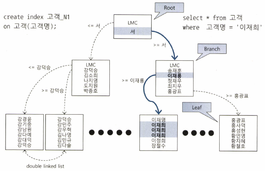
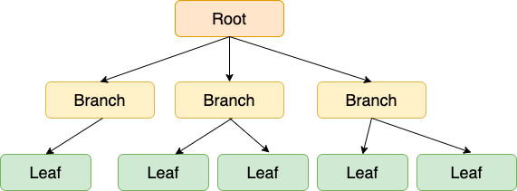

### 인덱스 구조 및 탐색

**미리보는 인덱스 튜닝**

- 데이터를 찾는 두 가지 방법
    - 테이블 전체를 스캔한다
    - 인덱스를 이용한다
- 인덱스 튜닝의 두 가지 핵심 요소
    - 인덱스 스캔 호율화 튜닝
        - 인덱스 스캔 과정에서 발생하는 비효율을 줄이는 것
        - ex) 학생 명부를 이름과 시력순으로 정렬해 두었다면 시력이 1.0 ~ 1.5인 홍길동 학생을 찾을 때 소량만 스캔하면 된다
    - 랜덤 액세스 최소화 튜닝
        - 테이블 액세스 횟수를 줄이는 것
        - ex) 시력이 1.0~1.5인 학생은 50명이고, 이름이 ‘홍길동’인 학생은 다섯 명이다 이 때 정렬이 시력, 이름 순으로된 명부다 따로 있다면 이름 순으로 정렬한 명부가 효과적일것이다
    - 둘 다 중요하지만 더 중요한 하나를 고른다면 랜덤 액세스 최소화 튜닝이다. 성능에 미치는 영향이 더 크기 때문이다 (난 잘 모르겠다… 케바케 아닐까)
    - **SQL 튜닝은 랜덤 I/O와의 전쟁이다**

**인덱스 구조**

- 인덱스
    - 대용량 테이블에서 필요한 데이터만 빠르게 효율적으로 액세스하기 위해 사용하는 오브젝트
    - 색인과 같은 역할을 한다
    - 인덱스를 이용하면 일부만 읽고 멈출 수 있다. 즉, 범위 스캔(Range Scan)이 가능하다
- DBMS는 일반적으로 B*Tree 인덱스를 사용한다

  

  

    - Tree 에 관한 글 ([https://zorba91.tistory.com/293](https://zorba91.tistory.com/293))
    - 리프 블록에 저장된 각 레코드는 키값 순으로 정렬되어 있을 뿐만 아니라 테이블 레코드를 가리키는 주소값, 즉 ROWID를 갖는다
    - 인덱스를 스캔하는 이유는, 검색 조건을 만족하는 소량의 데이터를 빨리 찾고 거기서 ROWID를 얻기 위해서이다
        - ROWID = 데이터 블록 주소 + 로우 번호
        - 데이터 블록 주소 = 데이터 파일 번호 + 블록 번호
        - 블록 번호 : 데이터파일 내에서 부여한 상대적 순번
        - 로우 번호 : 블록 내 순번
    - 인덱스 탐색 과정은 수직적 탐색과 수평적 탐색으로 나눌 수 있다
        - 수직적 탐색 : 인덱스 스캔 시작지점을 찾는 과정
        - 수평적 탐색 : 데이터를 찾는 과정

**인덱스 수직적 탐색**

- 정렬된 인덱스 레코드 중 조건을 만족하는 첫 번째 레코드를 찾는 과정
- 인덱스 스캔 시작지점을 찾는 과정(조건에 만족하는 첫 번째 레코드를 찾는 것이 목표) ⇒ 기억하자!
- ex) 푯말을 만날 때마다 어느 쪽으로 가면 목표 레코드를 만날 수 있는지 확인하면서 이동한다
  푯말이 알려주는 대로 따라가다 보면 ‘조건을 만족하는 첫 번째 레코드’를 만날 수 있다

**인덱스 수평적 탐색**

- 수직적 탐색을 통해 스캔 시작점을 찾았으면, 찾고자 하는 데이터가 더 안나타날 때까지 인덱스 리프 블록을 수평적으로 스캔한다
- 인덱스에서 본격적으로 데이터를 찾는 과정(인덱스 리프 블록끼리는 서로 앞뒤 블록에 대한 주소값을 가짐. 즉, 양방향 연결리스트(double linked list) 구조임으로 좌에서 우로, 또는 우에서 좌로 수평적 탐색이 가능)
