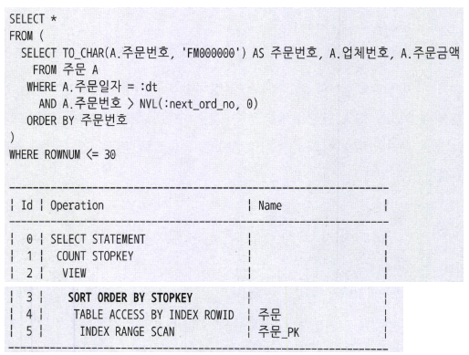
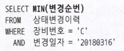
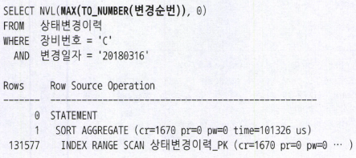
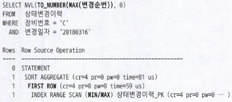

### 인덱스 기본 사용법

**인덱스를 Range Scan 할 수 없는 이유**

> 인덱스 컬럼을 가공하면 인덱스를 정상적으로 사용(Range Scan)할 수 없다
>

왜냐하면 인덱스 스캔 시작점을 찾을 수 없기 때문이다

즉, Index Rang Scan은 인덱스에서 일정 범위를 스캔한다는 뜻이다 일정 범위를 스캔하려면 '시작지점'과 '끝지점'이 있어야 한다

- 스캔 시작지점과 종료지점을 알 수 없는 가공된 쿼리 예시
    - `where substr(생년월일, 5, 2) = '05'`
        - 인덱스는 가공되지 않는 값이 저장돼 있는데, 가공된 값을 기준으로 검색하려면 어디서 스캔을 시작하고 멈춰야 할지 모른다
    - `where nvl(주문수량, 0) < 100`
        - 가공하지 않은 주문수량으로 인덱스를 만들었는데, '값이 NULL이면 0으로 치환한 값'기준으로 100보다 작은 레코드를 찾아달라고 쿼리를 작성하면 인덱스를 정상적으로 사용할 수 없다
    - `where 업체명 like '%대한%'`
        - LIKE 중간 값을 검색할 때도 '대한'으로 시작하는 값은 특정 구간에 모여 있으므로 Range Scan이 가능하나, '대한'을 포함하는 값은 전체 구간에 걸쳐 흩어져 있어 Range Scan이 불가능하다

- where (전화번호 = :tel_no OR 고객명 = :cust_nm)
    - OR 조건으로 검색할 때, 수직적 탐색을 통해 전화번호가 '01012345678'이거나 고객명이 '홍길동'인 어느 한 시작지점을 바로 찾을 수 없다
    - 단, 아래와 같이 쿼리 작성하면 고객명, 전화번호 인덱스 각각에 대해 Index Range Scan이 가능하다

    ```sql
    select *
      from 고객
     where 고객명 = :cust_nm # 고객명이 선두 컬럼인 인덱스 Range Scan
     union all
    select *
      from 고객
     where 전화번호 = :tel_no # 전화번호가 선두 컬럼인 인덱스 Range Scan
       and (고객명 <> :cust_nm or 고객명 is null)
    ```

- IN 조건은 OR 조건을 표현하는 다른 방식일 뿐이다 (ALL)
- `union all` 을 사용하면 각 브랜치 별로 인덱스 스캔 시작점을 찾을 수 있다
- 그래서 IN 조건절에 대해서는 SQL 옵티마이저가 IN-List Iterator 방식을 사용한다
- IN-List 개수만큼 Index Range Scan을 반복하는 것이다
- 결국엔 `union all` 으로 변환한 것과 같은 효과를 얻을 수 있다

> **정리**
’인덱스를 정상적으로 사용한다’는 표현은 리프 블록에서 스캔 시작점을 찾아 거기서부터 스캔하다가 중간에 멈추는 것을 의미한다
위 예시와 같은 조건절에는 인덱스를 정상적으로 사용할 수 없다
기본적으로 Index Range Scan이 불가능 하다
단, OR 또는 IN 조건절은 옵티마이저의 쿼리변환 기능을 통해 Index Range Scan으로 처리되기도 한다
>

**더 중요한 인덱스 사용 조건**

- 인덱스를 Range Scan하기 위한 가장 첫 번째 조건은 인덱스 선두 컬럼이 조건절에 있어야 한다는 사실이다
- 즉, 인덱스 선투 컬럼이 가공되지 않은 상태로 조건절에 있으면 인덱스 Range Scan은 무조건 가능하다
- 우리가 흔히 말하는 ‘인덱스 탄다’는 표현은 ‘인덱스를 Range Scan한다’는 의미와 같은 셈이다

**인덱스를 이용한 소트 연산 생략**

- 인덱스를 Range Scan 할 수 있는 이유는 데이터가 정렬돼 있기 때문이다 찾고자 하는 데이터가 정렬된 상태로 서로 모여있기 때문에 전체가 아닌 일정 부분만 읽다가 멈출 수 있다
- 테이블과 달리 **인덱스는 정렬**돼 있기 때문에 인덱스를 사용한다 인덱스가 정렬돼 있어서 Range Scan이 가능하고, 소트 연산 생략 효과도 부수적으로 얻게 된다
- 인덱스가 장비번호 + 변경일자 + 변경순번일 때
    - 장비번호와 변경일자를 모두 '='조건으로 검색할 때 PK 인덱스를 사용하면 결과집합은 변경순번 순으로 출력된다
    - 옵티마이저는 이런 속성을 활용해 SQL에 ORDER BY가 있어도 정렬 연산을 따로 수행하지 않는다
    - PK 인덱스를 스캔하면서 출력한 결과집합은 어차피 변경순번 순으로 정렬되기 때문이다
- 만약 정렬 연산을 생략할 수 있게 인덱스가 구성돼 있지 않다면 SORT ORDER BY 연산 단계가 추가된다

**ORDER BY 절에서 컬럼 가공**

- 조건절이 아닌 ORDER BY 또는 SELECT-LIST에서 컬럼을 가공함으로 인해 인덱스를 정상적으로 사용할 수 없는 경우도 종종 있다



- 여기서 ORDER BY 가 나타난 이유는, ORDER BY절에 기술한 '주문번호'는 순수한 주문번호가 아닌 TO_CHAR 함수로 가공한 주문번호를 가리키기 때문이다
- 해결방법 : ORDER BY절에 주문번호에 A(주문 테이블 Alias)를 붙여주기만 하면 된다

**SELECT-LIST에서 컬럼 가공**

- 인덱스를 장비번호 + 변경일자 + 변경순번 순으로 구성

  

    - 변경순번 최소값을 구할 때도 옵티마이저는 정렬 연산을 따로 수행하지 않는다
    - 수직적 탐색을 통해 조건을 만족하는 가장 왼쪽 지점으로 내려가서 첫 번째 읽는 레코드가 바로 최소값이기 때문이다
    - 최대값 또한 정렬 연산을 수행하지 않는다 최소값을 찾아 수직적 탐색할 때 왼쪽으로 내려갔다면, 최대값을 찾을 때는 오른쪽으로 내려가는 점만 다르다 수직적 탐색을 통해 조건을 만족하는 가장 오른쪽 지점으로 내려가서 첫 번째 읽는 레코드가 바로 최대값이다

  

    - SQL을 위와 같이 작성하면 정렬 연산을 생략할 수 없다 인덱스에는 문자열 기준으로 정렬돼 있는데, 이를 숫자값으로 바꾼 값 기준으로 최종 변경순번을 요구했기 때문이다
    - SQL을 아래와 같이 바꾸면 정렬 연산 없이 최종 변경순번을 쉽게 찾을 수 있다 물론 이렇게 변환하려면 변경순번 값이 고정너비로 입력돼 있어야 한다 애초에 변경순번 데이터타입을 숫자형으로 설계했다면 이렇게 튜닝할 일도 안 생긴다

  


**자동 형변환**

- 조건절에서 양쪽 값의 데이터 타입이 서로 다르면 값을 비교할 수 없다
- 그럴 때 카입 체크를 엄격히 함으로써 컴파일 시점에 에러를 내는 DBMS가 있는가 하면, 자동으로 형변환 처리해주는 DBMS도 있다
- 자동형변환으로 인덱스 사용에 지장을 줄 수 있으니 참고해야 한다
- 자동 형변환에 대한 결론은 명확하다 이 긴으에 의존하지 말고, 인덱스 컬럼 기준으로 반대편 컬럼 또는 값을 정확히 형변환해 주어야 한다
