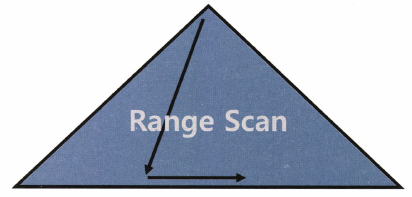
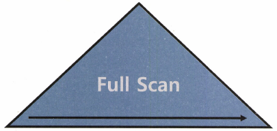
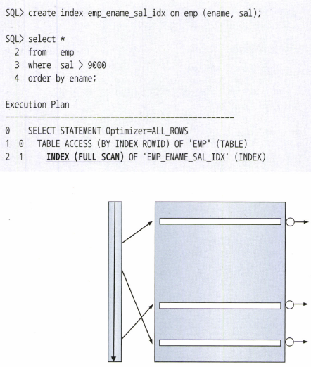
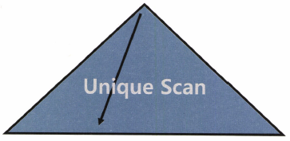
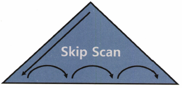
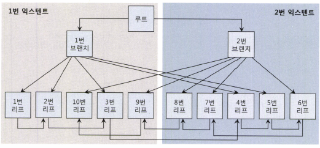
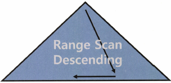

### 인덱스 확장 기능 사용법

**Index Range Scan**

- B*Tree의 인덱스의 가자아 일반적이고 정상적인 형태의 액세스 방식이다
- 인덱스 루트에서 리프 블록까지 수직적으로 탐색한 후 필요한 범위(Range)만 스캔한다



- 앞서도 강조했지만, 인덱스를 Range Scan 하려면 선두 컬럼을 가공하지 않은 상태로 조건절에 사용해야 한다
- 반대로, 선두 컬럼을 가공하지 않은 상태로 조건절에 사용하면 Index Range Scan은 무조건 간읗나다
- 실행계획을 보고 ‘인덱스 잘 타니까 성능도 OK’라고 생각하면 안되는 이유가 바로 여기에 있다
- 성능은 인덱스 스캔 범위, 테이블 액세스 횟수를 얼마나 줄일 수 있느냐로 결정된다

**Index Full Scan**

- 수직적 탐색 없이 인덱스 리프 블록을 처음부터 끝까지 수평적으로 탐색하는 방식이다



- Index Full Scan은 대개 데이터 검색을 위한 최적의 인덱스가 없을 때 차선으로 선택한다
- Index full Scan의 효용성
    - 데이터 저장공간은 '컬럼 길이 X 레코드 수'에 의해 결정되므로 인덱스가 차지하는 면적은 테이블보다 훨씬 작다
    - 인덱스를 Range Scan할 수 없을 때, 테이블 전체를 스캔하기보다 인덱스 전체를 스캔하면 어떨까?
    - 만약 인덱스 스캔 단계에서 대부분 레코드를 필터링하고 아주 일부만 테이블을 액세스하는 상황이라면, 면적이 큰 테이블보다 인덱스를 스캔하는 쪽이 유리하다

  

    - 9000인 사원이 그림처럼 전체 중 극히 일부라면 Table Full Scan보다는 Index Full Scan을 통한 필터링이 효과적이다
    - 하지만 이 방식은 적절한 인덱스가 없어 Index Range Scan의 차선책으로 선택한 것이다 수행빈도가 낮은 SQL이면 상관 없지만, 그렇지 않다면 SAL 컬럼이 선두인 인덱스를 생성해주는 것이 좋다
- 인덱스를 이용한 소트 연산 생략
    - 인덱스를 Full Scan하면 Range Scan과 마찬가지로 결과집합이 인덱스 컬럼 순으로 정렬된다
    - 따라서 Sort Order By 연산을 생략할 목적으로 사용할 수도 있다
    - 이때는 차선책이 아닌 옵티마이저가 전략적으로 선택한 경우에 해당한다

  > **주의**
  >
  >
  > 사용자가 처음 의도(부분범위 처리 활용)과 달리 fetch를 멈추지 않고 데이터를 끝까지 읽는다면 Table Full Scan보다 훨씬 더 많은 I/O를 일으키고 결과적으로 수행 속도가 훨씬 더 느려진다는 사실이다 이는 결코 옵티마이저 잘못이 아니며, first_rows 힌트를 사용한 사용자에게 책임이 있다


**Index Unique Scan**

- 수직적 탐색만으로 데이터를 찾는 스캔 방식으로서, Unique 인덱스를 '='조건으로 탐색하는 경우에 작동한다



- Unique 인덱스가 존재하는 컬럼은 중복 값이 입력되지 않게 DBMS가 데이터 정합성을 관리해 준다
- 따라서 해당 인덱스 키 컬럼을 모두 '='조건으로 검색할 때는 데이터를 한 건 찾는 순간 더 이상 탐색할 필요가 없다
- Unique 인덱스라고 해도 범위검색 조건(between, 부등호, like)으로 검색할 때는 Index Range Scan으로 처리된다
- 또한, Unique 결합 인덱스에 대해 일부 컬럼만으로 검색할 때도 Index Range Scan이 나타난다
    - Ex) 주문상품 PK 인덱스를 '주문일자 + 고객ID + 상품ID'로 구성했는데, 주문일자와 고객ID로만 검색하는 경우

**Index Skip Scan**

- 인덱스 선두 컬럼을 조건절에 사용하지 않으면 옵티마이저는 기본적으로 Table Full Scan을 선택한다
- Table Full Scan 보다 I/O를 줄일 수 있거나 정렬된 결과를 쉽게 얻을 수 있다면, Index Full Scan을 사용하기도 한다
- 오라클은 인덱스 선두 컬럼이 조건절에 없어도 인덱스를 활용하는 새로운 스캔 방식을 9i 버전에서 선보였는데, Index Skip Scan이 바로 그것이다 (MySQL에서는 8.0 Skip Scan Access Method)
- 조건절에 빠진 인덱스 선두 컬럼의 Distinct Value 개수가 적고 후행 컬럼의 Distinct Value 개수가 많을 때 유용하다
- ex) 고객 테이블에서 Distinct Value 개수가 가장 적은 컬럼은 '성별'이다. Distinct Value 개수가 가장 많은 컬럼은 '고객번호'다
- Index Skip Scan은 루트 또는 브랜치 블록에서 읽은 컬럼 값 정보를 이용해 조건절에 부합하는 레코드를 포함할 '가능성이 있는' 리프 블록만 골라서 액세스하는 스캔 방식이다



- Index Skip Scan이 작동하기 위한 조건
    - Index Skip Scan은 Distinct Value 개수가 적은 선두 컬럼이 조건절에 없고 후행 컬럼의 Distinct Value 개수가 많을 때 효과적이라고 했다
    - 하지만 인덱스 선두 컬럼이 없을 때만 Index Skip Scan이 작동하는 것은 아니다
    - 선두 컬럼에 대한 조건절은 있고, 중간 컬럼(=업종코드)에 대한 조건절이 없는 경우에도 Skip Scan을 사용할 수 있다
    - Distinct Value가 적은 두 개의 선두컬럼이 모두 조건절에 없는 경우에도 유용하게 사용할 수 있다
    - 선두 컬럼이 부등호, BETWEEN, LIKE 같은 범위검색 조건일 때도 Index Skip Scan을 사용할 수 있다
- Index Skip Scan을 사용한다면, 기준일자 BETWEEN 조건을 만족하는 인덱스 구간에서  조건을 레코드를 포함할 가능성이 있는 리프 블록만 골라서 액세스 할 수 있다
- Index Range Scan이 불가능하거나 효율적이지 못한 상황에서 Index Skip Scan이 종종 빛을 발한다
- 하지만 이들 스캔 방식이 최선책일 수 없다인덱스는 기본적으로 최적의 Index Range Scan을 목표로 설계해야 하며, 수행 횟수가 적은 SQL을 위해 인덱스를 추가하는 것이 비효율적일 때 이들 스캔 방식을 차선책으로 활용하는 전략이 바람직하다

**Index Fast Full Scan**

- Index Fast Full Scan은 Index Full Scan 보다 빠르다
- 더 빠른 이유는 논리적인 인덱스 트리 구조를 무시하고 인덱스 세그먼트 전체를 Multiblock I/O 방식으로 스캔하기 때문이다



- Index Full Scan은 인덱스의 논리적 구조를 따라 루트 → 브랜치1 → 1 → 2 → 3 → 4 → 5 → 6 → 7 → 8 → 9 → 10번 순으로 블록을 읽어들인다
- 반면, Index Fast Full Scan은 물리적으로 디스크에 저장된 순서대로 인덱스 리프 블록들을 읽어들인다
- Multiblock I/O 방식으로 왼쪽 익스텐트에서 1 → 2 → 10 → 3 → 9번 순으로 읽고, 그 다음 오른쪽 익스텐트에서 8 → 7 → 4 → 5 → 6번 순으로 읽는다
- 루트와 두 개의 브랜치 블록도 읽지만 필요 없는 블록이므로 버린다
- 특정
    - Multiblock I/O 방식 사용(디스크로부터 대량의 인덱스 블록을 읽어야 할 때 큰 효과 발휘)
    - 인덱스 키 순서대로 정렬되지 않음(속도는 빠르나 인덱스 리프 노드가 갖는 연결 리스트 구조를 무시한 채 데이터를 읽기 때문에 결과집합이 인덱스 키 순서대로 정렬되지 않는다)
    - 쿼리에 사용한 컬럼이 모두 인덱스에 포함돼 있을 때 사용 가능
    - 인덱스가 파티션 돼 있지 않더라도 병렬 쿼리가 가능(Index Range Scan 또는 Index Full Scan과 달리)
    - 병렬 쿼리 시에는 Direct I/O방식 사용하기 때문에 I/O 속도가 더 빨라짐

| Index Full Scan                 | Index Fast Full Scan          |
|---------------------------------|-------------------------------|
| 1. 인덱스 구조를 따라 스캔                | 1. 세그먼트 전체를 스캔                |
 | 2. 결과집합 순서 보장                   | 2. 결과집합 순서 보장 안 됨             |
| 3. Single Block I/O             | 3. Multiblock I/O             |
| 4. (파티션 돼 있지 않다면) 병렬스캔 불가       | 4. 병렬스캔 가능                    |
| 5. 인덱스에 포함되지 않은 컬럼 조회 시에도 사용 가능 | 5. 인덱스에 포함된 컬럼으로만 조회할 때 사용 가능 |


**Index Range Scan Descending**

- ****Index Range Scan과 기본적으로 동일한 스캔 방식
- 인덱스를 뒤에서부터 앞쪽으로 스캔하기 때문에 내림차순으로 정렬된 결과집합을 얻는다는 점만 다르다



- 아래처럼 EMP 테이블을 EMPNO 기준으로 내림차순 정렬하고자 할 때 EMPNO 컬럼에 인덱스가 있으면 옵티마이저가 알아서 인덱스를 거꾸로 읽는 실행계획을 수립한다

```sql
select * from emp
where empno > 0
order by empno desc;
```

- 만약 옵티마이저가 인덱스를 거꾸로 읽지 않는다면, index_desc 힌트를 이용해 유도할 수 있다
- 아래처럼 MAX 값을 구하고자 할 때도 해당 컬럼에 인덱스가 있으면 인덱스를 뒤에서부터 한 건만 읽고 멈추는 실행계획이 자동으로 수립된다

```sql
select deptno, dname, loc
	, (select max(sal) from emp where deptno = d.deptno)
from dept d;
```
