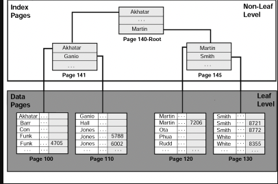

<aside>
💡 핵심 원리를 알아보자

</aside>

### 인덱스 튜닝의 두 가지 핵심 요소

1. 인덱스 스캔 효율화 튜닝
2. 랜덤 액세스 최소화 튜닝(테이블 액세스 횟수를 줄이는 것) ⇒ 이것이 중요!!

### 인덱스 구조

---

대용량 테이블에서 필요한 데이터만 빠르게 효율적으로 액세스하기 위해 사용하는 오브젝트 (책에 있는 색인 느낌!)

**인덱스가 없다면?**

- 테이블을 처음부터 끝까지 모두 읽어야합니다.

**인덱스를 사용한다면?**

- 일부만 읽고 멈춘다. ⇒ 범위 스캔

**인덱스가 사용하는 알고리즘은? B-트리**

일반적으로 DBMS에서는 주로 B+-Tree 또는 B*-Tree가 사용된다.

주의할 점이 B는 binary(이진)이 아닌 Balanced 입니다.

insert 작업 또는 delete 작업을 할 때 인덱스가 불균형 상태에 놓일 수도 있을거라고 생각을 하게 되는데 B*tree에서는 이런 현상이 절대 발생하지 않는다. 즉 balanced는 인덱스 루트에서 리프 블록에 도달하기까지 읽는 블록 수가 같음을 의미합니다.

root, branch, reaf로 구성되어 있습니다.

그리고 루트와 브랜치 블록에 있는 각 레코드는 하위 블록에 대한 주소값을 가지고 있습니다.

### 인덱스를 찾는 과정

---

**수직적 탐색**

인덱스 스캔 시작지점을 찾는 과정입니다. ⇒ 아까 말한 각 레코드는 하위 블록에 대한 주소값을 가지고 있기 때문에 루트블록에서 리프 블록까지 수직적 탐색이 가능한 이유입니다.

**즉 조건을 만족하는 레코드를 찾는 과정이 아니라 조건을 만족하는 첫 번째 레코드를 찾는 과정이다!!!**

**수평적 탐색**

수직적 탐색으로 시작점을 찾았으면 착고자 하는 데이터가 더 안나타날 때까지 인덱스 리프 블록을 수평적으로 스캔한다. 리프 블록끼리는 서로 앞뒤의 블록에 대한 주소값을 가지는 연결 리스트 구조이기 때문에 수평적으로 탐색이 가능하다.

**즉 조건절을 만족하는 데이터를 모두 찾기 위해서 + rowid를 얻기 위한 과정이다.**

### 결합 인덱스 구조와 탐색

---

두 개 이상 컬럼을 결합해서 인덱스를 만들 수 있다.

인덱스가 [성별 + 이름]이라면 인덱스 찾는 과정에서
**인덱스 스캔 시작점이 성별 = ‘남’이 아니라 성별=’남’ 이면서 고객명 = ‘홍길동’인 레코드를 찾는다.**

인덱스는 다음 조건을 가질 때 효율적이다.

- **카디널리티 (Cardinality) 높은 것 (중복도)**
- **선택도 (Selectivity) 낮은 것**