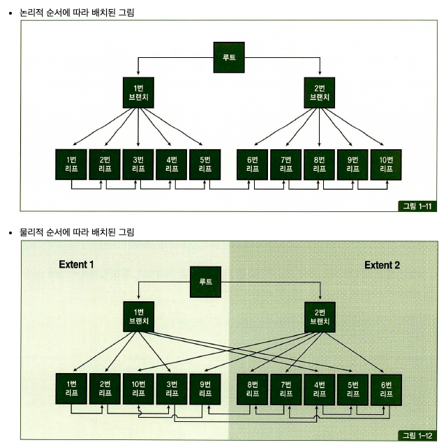

<aside>
💡 index full scan, index unique scan, index skip scan, index fast full scan

</aside>

### Index range scan

---

핵심은 필요한 범위만 스캔한다.

- 컬럼 가공 X
- 인덱스 스캔 범위, 테이블 액세스 횟수를 얼마나 줄일 수 있느냐

### index full scan

---

인덱스 리프 블록을 처음부터 끝까지 수평적으로 탐색한다.

- 데이터 검색을 위한 최적의 인덱스가 없을 때 차선으로 선택한다.
- 인덱스 선두컬럼이 아닌것은 index range scan이 불가능

**효용성**

- 인덱스 선두 컬럼이 조건절에 없으면 table full scan 고려
- index range scan이 불가능 할 떄 면적이 넓은 테이블을 스캔하는 것보다 면적이 작은 인덱스를 full scan하는 것이 좋기 때문에 옵티마이저는 Index full scan 방식을 사용한다.

**소트 연산 생략**

- 결과집합이 인덱스 컬럼 순으로 정렬된다. ⇒ 소트 연산 생략

```sql
select * from customer
where sal > 9000
```

```sql
select * from customer
where sal > 1000
```

- sal > 1000 상황에서 index full scan 선택하면 거의 모든 레코드에 대한 테이블 액세스가 발생하므로 table full scan 보다 오히려 불리하다.
- ⇒ sal > 1000이면 single bock I/O로 많은 데이터를 가져오는것이  multiblock I/O로 테이블 전체 가져오는 것보다 느리다는 얘기같다.

### Index unique scan

---

수직적 탐색만으로 데이터를 찾는 스캔 방식

- 인덱스 키 컬럼을 모두 ‘=’ 조건으로 검색할 때
- 결합 인덱스에 대해 일부 컬럼만 사용하면 index range scan이 나타남

### Index skip scan

---

루트 또는 브랜치 블록에서 읽은 컬럼 값 정보를 이요해 조건절에 부합하는 레코드를 포함할 ‘가능성이 있는’ 리프 블록만 골라서 액세스 하는 스캔 방식

**인덱스 선두 컬럼의 distinct value 개수가 적고 후행 컬럼의 distinct value 개수가 많을 때 유용**하다.

```sql
select *
from 사원
where 연봉 between 2000 and 4000;
```

- 예를 들어 남 & 800 ~ 남 & 1500이 있는 리프블록은 2000 < 연봉 < 4000일 가능성이 없으므로 스킵하는 형태이다.

**distict value가 적은 두 개의 선두 컬럼이 모두 조건절에 없는 경우에도 유용**하다.

### Index fast full scan

---

논리적인 인덱스 트리 구조를 무시하고 인덱스 세그먼트 전체를 Multiblock I/O로 스캔하는 방식

- 디스크에 저장된 순서대로 인덱스 리프 블록들을 읽어들인다.



- 연결 리스트 구조를 무시한 채 데이터를 읽기 때문에 결과집합이 인덱스 키 순서대로 정렬되지 않는다.
- 인덱스가 파티션 돼 있지 않더라도 병렬 쿼리가 가능한 것도 중요한 특징이다.
- 쿼리에 사용한 컬럼이 모두 인덱스에 포함돼 있을 때만 사용할 수 있다.

### Index range scan descending

---

index range scan과 같은데 내림차순으로 정렬된 결과 집합

### 결론

인덱스는 기본적으로 최적의 Index range scan을 목표로 설계해야한다.