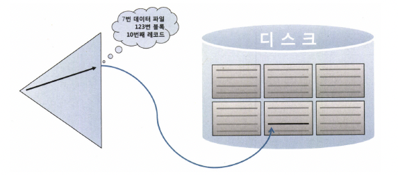
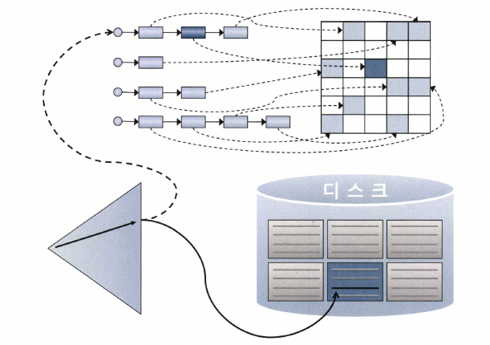
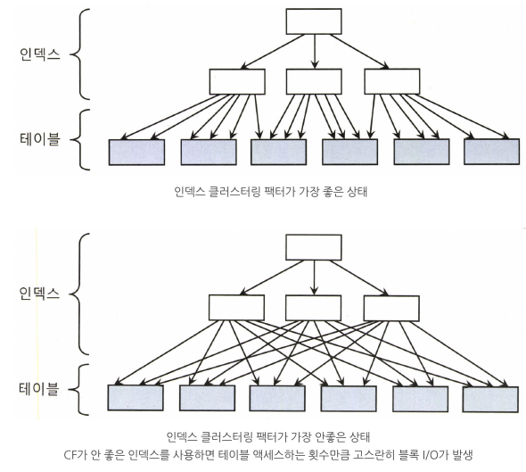
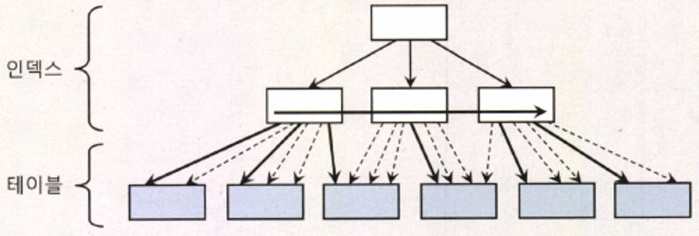
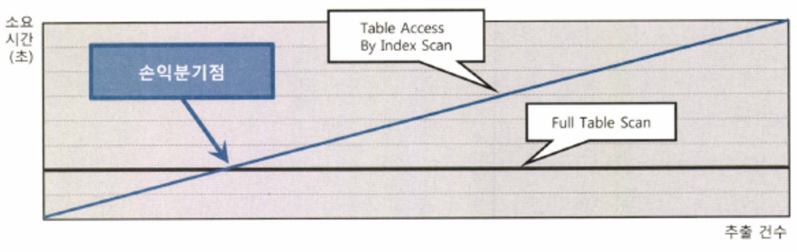
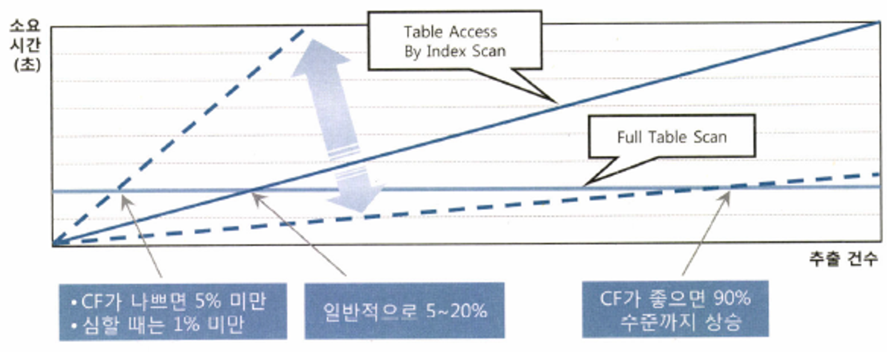
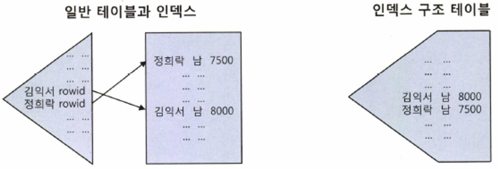
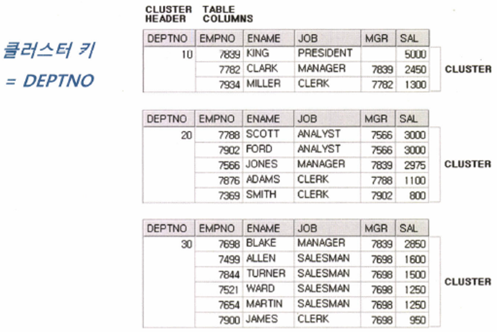
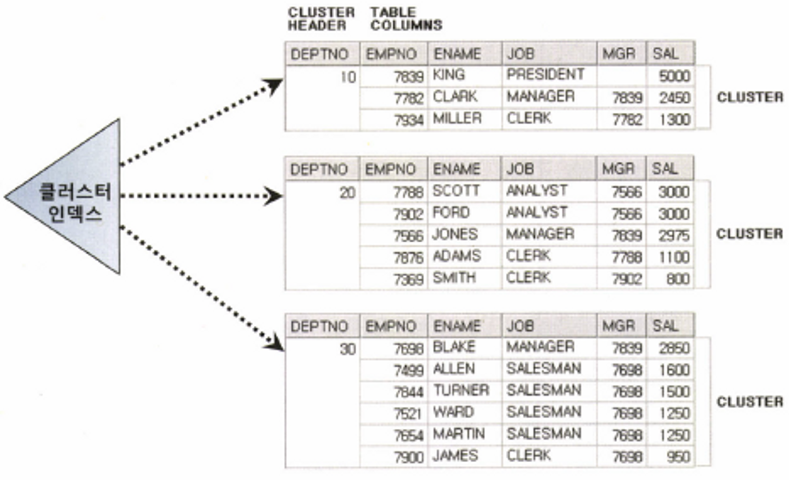
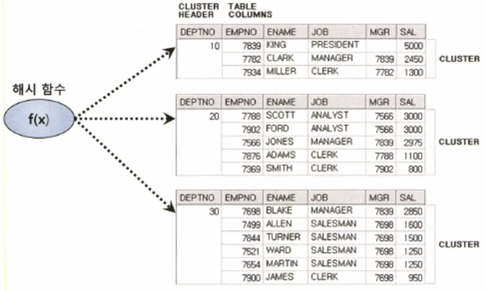

### 테이블 액세스 최소화

**테이블 랜덤 액세스**

- 인덱스 ROWID는 물리적 주소? 논리적 주소?
    - ROWID는 물리적 주소보다 논리적 주소에 가깝다
    - ROWID는 데이터파일 번호, 오브젝트 번호, 블록 번호 같은 물리적 요소로 구성되어 있어서 물리적 주소라는 주장은 틀리다고 할 수 없지만
      논리적 주소에 더 가까운 이유는 테이블 레코드를 찾아가기 위한 논리적 주소 정보를 담고 있기 때문이다

  

    - 정리하면, 인덱스 ROWID는 논리적 주소이다
    - (프로그래밍에서 말하는) 포인터가 아니며, 테이블 레코드와 물리적으로 직접 연결된 구조는 더더욱 아니다
- 메인 메모리 DB와 비교
    - 일반 DBMS에서 인덱스 ROWID를 이용한 테이블 액세스가 생각만큼 빠르지 않은 이유 2가지가 있다
        - 오라클(디스크 상의 주소 정보를 가지고 있는 DB) 테이블 블록이 수시로 버퍼 캐시에 밀려났다가 다시 캐싱되며, 그 때 마다 다른 공간에 캐싱되기 때문에 인덱스에서 포인터로 직접 연결할 수 없는 구조이다
        - 메모리 주소 정보(포인터)가 아닌 디스크 주소 정보(DBA, Data Block Addrss)를 이용해 해시 알고리즘으로 버퍼 블록을 찾아간다
- I/O 매커니즘 복습
    - DBA(= 데이터 파일 번호 + 블록 번호)는 디스크 상에서 블록을 찾기 위한 주소 정보이다
    - 매번 디스크에서 블록을 찾을 수 없기 때문에 I/O 성능을 높이려면 버퍼캐시를 활용해야 한다
      그래서 블록을 읽을 때는 디스크로 가기 전에 버퍼캐스로부터 찾아본다
      읽고자 하는 DBA를 해시 함수에 입력해서 해시 체인을 찾고 거기서 버퍼 헤더를 찾는다
    - 캐시에 적재할 때와 읽을 때 같은 해시 함수를 사용하므로 버퍼 헤더는 항상 같은 해시 체인에 연결된다
      반면, 실제 데이터가 담긴 버퍼 블록은 매번 다른 위치에 캐싱되는데, 그 메모리 주소값을 버퍼 헤더가 가지고 있다
      정리하면, 해싱 알고리즘으로 버퍼 헤더를 찾고, 거기서 얻은 포인터로 버퍼 블록을 찾아간다

  

    - 모든 데이터가 캐싱돼 있더라도 테이블 레코드를 찾기 위해 매번 DBA 해싱과 래치 획득 과정을 반복해야 한다
      동시 액세스가 심할 때는 캐시버퍼 체인 래치와 버퍼 Lock에 대한 경합까지 발생한다
    - 이처럼 인덱스 ROWID를 이용한 테이블 액세스는 생각보다 고비용 구조다
      **즉, 'TABLE ACCESS BY INDEX ROWID'는 고비용 연산!**
- 인덱스 ROWID는 우편 주소

    ```yaml
    우편 주소 : 서울시 중구 무교동 123번지 OO타워 10층
    ROWID : 7번 데이터 파일 123번 블록에 저장된 10번 째 레코드
    ```


**인덱스 클러스터링 팩터**

- 클러스터링 팩터(Clustering Factor, 이하 ‘CF’)
    - ‘군집성 계수’ 쯤으로 번역할 수 있는 용어로서, 특정 컬럼을 기준으로 같은 값을 갖는 데이터가 서로 모여인는 정도를 의미
    - 물리적으로 근접해 있으면 흩어져 있을 때보다 데이터를 찾는 속도가 빠르다

  

- 인덱스 클러스터링 팩터 효과
    - CF가 좋은 컬럼에 생성한 인덱스는 검색 효율이 좋다 = 테이블 액세스량에 비해 블록 I/O가 적게 발생한다
    - 인덱스 ROWID로 테이블을 액세스할 때, 오라클은 래치 획득과 해시 체인 스캔 과정을 거쳐 어렵게 찾아간 테이블 블록에 대한 포인터(메모리 주소값)를 바로 해제하지 않고 일단 유지한다. = 버퍼 Pinning
    - 이 상태에서 다음 인덱스 레코드를 읽었는데, 마침 직전과 같은 테이블 블록을 가리킨다 그러면 래치 획득과 해시 체인 스캔 과정을 생략하고 바로 테이블 블록을 읽을 수 있다 논리적인 블록 I/O 과정을 생략할 수 있는 것이다
    - CF가 좋은 인덱스를 사용할 때 테이블 액세스 횟수에 비해 블록 I/O가 적게 발생하는 이유

  

    - 굵은 실선 : 실제 블록 I/O가 발생하는 경우
    - 가는 점선 : 블록을 찾아가는 과정(논리적인 블록 I/O) 없이 포인터로 바로 액세스하는 경우 (버퍼 Pinning 효과를 극대화하기 위해 그림처럼 인덱스 레코드와 테이블 레코드의 정렬 순서가 100% 일치할 필요는 없다. 다음에 읽을 테이블 블록과 직전에 읽은 테이블 블록 주소가 같기만 하면 된다.)

**인덱스 손익분기점**



- 인덱스 ROWID를 이용한 테이블 액세스는 생각보다 고비용 구조다 따라서 읽어야 할 데이터가 일정량을 넘는 순간, 테이블 전체를 스캔하는 것보다 오히려 느려진다
- Index Range Scan에 의한 테이블 액세스가 Table Full Scan보다 느려지는 지점을 흔히 '인덱스 손익분기점'이라 부른다 Table Full Scan은 성능이 일정하다. (10만~1000만)몇 건을 조회하든 차이가 거의 없다
- 인덱스를 이용해 테이블을 액세스할 때는 전체 중 몇 건을 추출하느냐에 따라 성능이 크게 달라진다. 당연히 추출 건수가 많을수록 느려진다. 바로 테이블 랜덤 액세스 때문이다.
- 추출 건수가 늘면서 인덱스 스캔량이 느는 데서도 영향을 받지만, 테이블 랜덤 액세스가 미치는 영향에 비교할 바가 아니다
- 인덱스를 이용한 테이블 액세스가 Table Full Scan보다 더 느려지게 만드는 가장 핵심적인 두 가지 요인
    - Table Full Scan은 시퀀셜 액세스인 반면, 인덱스 ROWID를 이용한 테이블 액세스는 랜덤 액세스 방식이다
    - Table Full Scan은 Multiblock I/O인 반면, 인덱스 ROWID를 이용한 테이블 액세스는 Single Block I/O 방식이다
- 이런 요인에 의해 인덱스 손익분기점은 보통 5~20%의 낮은 수준에서 결저오딘다. 그리고 CF에 따라 크게 달라진다

  

    - 인덱스 CF가 나쁘면 같은 테이블 블록을 여러번 반복 액세스하면서 논리적 I/O 횟수가 늘고, 물리적 I/O 횟수도 늘기 때문이다
    - CF가 나쁘면 손익분기점은 5% 미만에서 결정되며, 심할 때는(BCHR이 매우 안 좋을 때) 1% 미만으로 낮아진다
    - 반대로 CF가 아주 좋을 때(인위적으로 전체 데이터를 인덱스 컬럼 순으로 정렬해서 재입력 했을 때)는 손익분기점이 90% 수준까지 올라가기도 한다
- **온라인 프로그램 튜닝 vs 배치 프로그램 튜닝**
    - 대량 배치 프로그램에선 인덱스보다 Full Scan이 더 효과적이지만, 초대용량 테이블을 Full Scan하면 상단히 오래 기다려야 하고 시스템이 주는 부담도 적지 않다
    - 따라서 배치 프로그램에서는 파티션 활용 전략이 매우 중요한 튜닝 요소이고, 병렬 처리까지 더할 수 있으면 금상첨화다
    - 다시 강조하지만, 모든 성능 문제를 인덱스로 해결하려 해선 안된다
    - 인덱스는 다양한 튜닝 도구 중 하나일 뿐이며, 큰 테이블에서 아주 적은 일부 데이터를 빨리 찾고자 할 때 주로 사용한다

**인덱스 컬럼 추가**

[[MYSQL] 컬럼 INDEX 추가, 삭제하기](https://hdhdeveloper.tistory.com/63)

- 테이블 액세스를 최소화 하기 위해 일반적으로 사용하는 튜닝 기법은 인덱스에 컬럼을 추가하는 것이다
- 인덱스를 필요할 때마다 계속 추가하다보면 테이블마다 인덱스가 수십 개씩 달려 인덱스 관리 비용이 증가함은 물론 DML 부하에 따른 트랜잭션 성능 저하가 생길 수 있다
- 그러므로 실 운영환경에서는 인덱스 구성을 변경하기가 쉽지 않으므로 기존 인덱스에 컬럼을 추가하는 것으로 튜닝 효과를 낸다 이 방식을 통해 인덱스 스캔량은 줄지 않지만, 테이블 랜덤 액세스 횟수를 줄여줄 수 있다

**인덱스만 읽고 처리**

- 반드시 성능을 개선해야 한다면, 쿼리에 사용된 컬럼을 모두 인덱스에 추가해서 테이블 액세스가 아예 발생하지 않게 하는 방법을 고려해 볼 수 있다. 참고로, 인덱스만 읽어서 처리하는 쿼리는 'Covered 쿼리'라고 부르며, 그 쿼리에 사용한 인덱스를 'Covered 인덱스'라고 부른다
- 이 방법은 효과는 매우 좋지만, 추가해야 할 컬럼이 많아 실제 적용하기 곤란한 경우도 많다.

**인덱스 구조 테이블**

- 인덱스를 이용한 테이블 액세스가 고비용 구조라 하니, 랜덤 액세스가 아예 발생하지 않도록 테이블을 인덱스 구조로 생성한 것은?
- 오라클 : IOT(Index-Organized Table)
- MS-SQL Server : 클러스터형(Clustered) 인덱스
- 인덱스 리프 블록이 곧 데이터 블록



- 테이블을 찾아가기 위한 ROWID를 갖는 일반 인덱스와 달리 IOT는 그 자리에 테이블 데이터를 갖는다즉, 테이블 블록에 있어야 할 데이터를 인덱스 리프 블록에 모두 저장하고 있다
- 테이블을 인덱스 구조로 만드는 구문

  `create table index_org_t ( a number, b varchar(10), constraint index_org_t_pk primary key(a) )
  organization index ;`

- 일반 테이블은 '힙 구조 테이블'이라 부른다 테이블 생성할 때 대개 생략하지만, 아래와 같이 organization 옵션을 명시할 수도 있다

  `create table heap_org_t ( a number, b varchar(10), constraint heap_org_t_pk primary key (a) )
  organization index ;`

- 일반 힙 구조 테이블에 데이터를 입력할 때는 랜덤 방식을 사용한다

**클러스터 테이블**

- **인덱스 클러스터 테이블**
    - 클러스터 키 값이 같은 레코드를 한 블록에 모아서 저장하는 구조다
    - 한 블록에 모두 담을 수 없을 때는 새로운 블록을 할당해서 클러스터 체인으로 연결한다

  

    - 심지어 여러 테이블 레코드를 같은 블록에 저장할 수도 있는데, 이를 '다중 테이블 클러스터'라고 부른다
    - 일반 테이블은 하나의 데이터 블록을 여러 테이블이 공유할 수 없음을 상기하기 바란다
    - 인덱스 클러스터 테이블을 구성하려면 먼저 아래와 같이 클러스터를 생성한다
      `create cluster c_dept# ( deptno number(2) ) index;`
    - 그리고 클러스터에 테이블을 담기 전에 아래와 같이 클러스터 인덱스를 반드시 정의해야 한다 왜냐면 클러스터 인덱스는 데이터 검색 용도로 사용할 뿐만 아니라 데이터가 저장될 위치를 찾을 때도 사용하기 때문이다
    - `create index c_dept#_idx on cluster c_dept#;`
      클러스터 인덱스를 만들었으면 아래와 같이 클러스터 테이블을 생성한다
    - 클러스터 인덱스도 일반 B*Tree 인덱스 구조를 사용하지만, 테이블 레코드를 일일이 가리키지 않고 해당 키 값을 저장하는 첫 번째 데이터 블록을 가리킨다는 점이 다르다 즉, 일반 테이블에 생성한 인덱스 레코드는 테이블 레코드와 1:1 대응 관계를 갖지만, 클러스터 인덱스는 그림에서 보듯 테이블 레코드와 1:M 관계를 갖는다
    - 따라서 클러스터 인덱스의 키 값은 항상 Unique하다(= 중복 값이 없다).

  

    - 이러한 구조적 특성 때문에 틀러스터 인덱스를 스캔하면서 값을 찾을 때 랜덤 액세스가 (클러스터 체인을 스캔하면서 발생하는 랜덤 액세스는 제외하고) 값 하나당 한 번씩 밖에 발생하지 않는다. 클러스터에 도달해서는 시퀀셜 방식으로 스캔하기 때문에 넓은 범위를 읽더라도 비효율이 없다는 게 핵심 원리다
- **해시 클러스터 테이블**
    - 해시 클러스터는 인덱스를 사용하지 않고 아래 그림처럼 해시 알고리즘을 사용해 클러스터를 찾아간다는 점만 다르다

  
