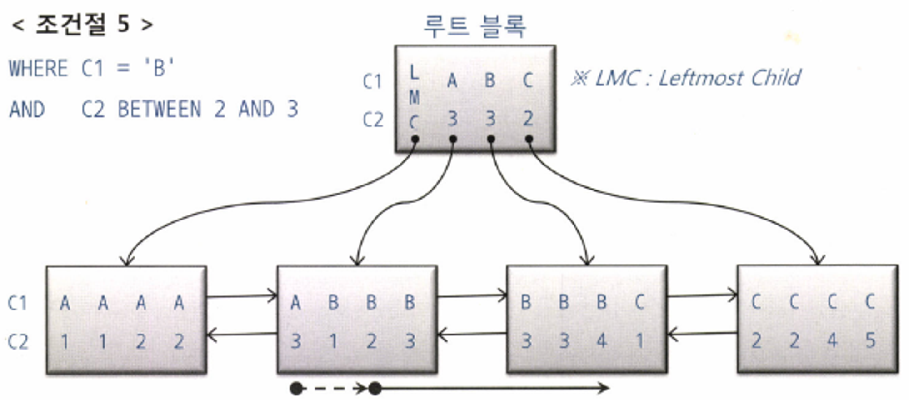

### 인덱스 스캔 효율화

**인덱스 탐색**

- **⭐ 수직적 탐색 : 스캔 시작점을  찾는 과정**
- LMC(Leftmost Child) 레코드 : 루트 블록에는 키 값을 갖지 않는 특별한 레코드는
- 리프 블록이 어느 지점에서 스캔을 시작하고 어느 지점에서 멈추는지 화살표를 통해 살펴보자

- 조건절 1 : `WHERE C1 = 'B'`

  

    - 조건절 1의 스캔 시작점과 끝점
    - 수직적 탐색을 통해 C1  'B'인 첫 번째 레코드를 찾고, 'C'를 만나는 순간 스캔을 멈춘다
    - 점선 화살표는 블록 내에서 시작점을 찾는 과정을 표시한 것이다. 우리는 지금 논리적인 스캔 시작점과 끝점을 확인하려는 것이므로 실선 화살표에 주목하자
- 조건절 2 : `WHERE C1 = 'B' AND C2 = 3`

  

    - 수직적 탐색을 통해 C1 = 'B'이고 C2 = 3인 첫 번째 레코드를 찾고, C1 = 'B'인 레코드 중에서 C2 = 4인 레코드를 만나는 순간 스캔을 멈춘다
    - C1과 C2 조건절 모두 스캔 시작과 끝 지점을 결정하는 데 중요한 역할을 했다. 즉, 스캔량을 줄이는 데 역할을 했다
- 조건절 3 : `WHERE C1 = 'B' AND C2 >= 3`

  

    - 수직적 탐색을 통해 C1 = 'B'이고 C2 >= 3인 첫 번째 레코드를 찾고, C1 = 'C'인 레코드를 만날 때까지 스캔하다가 멈춘다
    - C2 >= 3 조건절이 스캔을 멈추는 데는 역할을 전혀 못 하지만, 이 조건절로 인해 조건절1과 스캔 시작점이 달라진 데 주목하자 부등호 조건이지만 수직적 탐색 과정에 사용됨으로써 스캔 시작점을 결정하는 데 중요한 역할을 했다. 즉, 스캔량을 줄이는 데 역할을 했다
- 조건절 4 : `WHERE C1 = 'B' AND C2 <= 3`

  

    - 수직적 탐색을 통해 C1 = 'B'인 첫 번째 레코드를 찾고, 거기서부터 스캔하다가 C2 > 3인 첫 번째 레코드를 만나는 순간 스캔을 멈춘다
    - C2 <= 3 조건절은 수직적 탐색 과정에 전혀 쓰이질 않았다. 스캔 시작점을 결정하는 데 전혀 역할을 못했지만, 스캔을 멈추는 데는 중요한 역할을 했다. 즉, 스캔량을 줄이는 역할을 했다
- 조건절 5 : `WHERE C1 = 'B' AND C2BETWEEN 2 AND 3`

  

    - 수직적 탐색을 통해 C1 = 'B'이고 C2 >= 2인 첫 번째 레코드를 찾고, C2 > 3인 첫 번째 레코드를 만나는 순간 스캔을 멈춘다
    - 여기서는 C1과 C2 조건절 모두 스캔 시작과 끝 지점을 결정하는 데 중요한 역할을 했다. 즉, 스캔량을 줄이는 역할을 했다
- 조건절 6 : `WHERE C1 BETWWEN 'A' AND 'C' AND C2 BETWEEN 2 AND 3`

  

    - 수직적 탐색을 통해 C1 >= 'A'이고 C2 >= 2인 첫 번째 레코드에서 스캔을 시작하고, C1 = 'C'이고 C2 = 3인 레코드보다 값이 큰 레코드를 만나는 순간 스캔을 멈춘다
    - C1 조건절은 스캔 시작과 끝 지점을 결정하는 데 중요한 역할을 했지만, C2는 그렇지 못하다
    - 맨 앞 C1 = 'A'인 구간과 맨 뒤 C1 = 'C' 구간에서는 어느 정도 역할을 했지만, 중간 C1 = 'B' 구간에서는 전혀 역할을 못 했다. 즉, C2는 스캔량을 줄이는 데 거의 역할을 못 했다

**인덱스 스캔 효율성**

 

- 이 테이블에서 '성능검'으로 시작하는 레코드를 검색하려면 `WHERE C1 = '성' AND C2 = '능' AND C3 = '검` 과 같은 조건절을 사용한다
- 이 테이블에서 ‘성능’으로 시작하고 네 번째 컬럼이 ‘선’인 레코드를 검색하려면 `WHERE C1 = '성' AND C2 = '능' AND C4 = '선'` 과 같은 조건절을 사용한다

- 왜 이런 차이가 날까? **인덱스 선행 컬럼이 조건절에 없기 때문**이다
- 인덱스 스캔 효율성 측정
    - 인덱스 스캔 효율이 좋은지 나쁜지는 SQL 트레이스를 통해 쉽게 알 수 있다
    - [https://wooseok-uzi.tistory.com/7](https://wooseok-uzi.tistory.com/7) → MySQL 트레이스 확인

**액세스 조건과 필터 조건**

1. 인덱스 액세스 조건
    - 인덱스 스캔 범위를 결정하는 조건절
    - 스캔 시작점 결정, 종료 시점을 결정하는데 영향을 미치는 조건절
2. 인덱스 필터 조건
    - 테이블로 액세스할지를 결정하는 조건절
    - (직전에 스캔으로 본 그림) C1, C2, C3이 인덱스 액세스 조건 / C1, C2 인덱스 액세스 조건, C4는 인덱스 필터 조건
3. 테이블 필터 조건
    - 쿼리 수행 다음 단계로 전달하거나, 최종 결과집합에 포험할지 결정

> **옵티마이저의 비용 계산 원리**
>
>
> 인덱스를 이용한 테이블 액세스 비용
>
> = 인덱스 수직적 탐색 비용 + 인덱스 수평적 탐색 비용 + 테이블 랜덤 액세스 비용
>
> = 인덱스 루트와 브랜치 레벨에서 읽는 블록 수 + 인덱스 리프 블록을 스캔하는 과정에서 읽는 블록 수 + 테이블 액세스 과정에 읽는 블록 수
>

**인덱스 선행 컬림이 등치(=) 조건이 아닐 때 생기는 비효율**

- 인덱스 스캔 효율성은 인덱스 컬럼을 조건절에 모두 등치(=) 조건으로 사용할 때가 가장 좋다
- 리프 블록을 스캔하면서 읽은 레코드는 하나도 걸러지지 않고 모두 테이블 액세스로 이어지므로 인덱스 스캔 단계에서의 비효율은 전혀 없다
- 인덱스 컬럼 중 일부가 조건절에 없거나 등치 조건이 아니더라도, 그것이 뒤쪽 컬럼일 때는 비효율이 없다
- 반면, 인덱스 선행 컬럼이 조건절에 없거나 부등호, BETWEEN, LIKE 같은 범위검색 조건이면, 인덱스를 스캔하는 단계에서 비효율이 생긴다 (스캔이 더 넓어진다)
- 인덱스 선행 컬럼이 모두 '=' 조건일 때 필요한 범위만 스캔하고 멈출 수 있는 것은, 조건을 만족하는 레코드가 모두 한데 모여 있기 때문이다

**BETWEEN을 IN-List로 전환**

- BETWEEN 조건을 아래와 같이 In-List로 바꿔주면 큰 효과를 얻는 경우가 있다
- in을 3번의 where로 변환해서 탐색한다
- 주의 사항
    - In-List 개수가 많지 않아야 한다
    - 인덱스 스캔 과정에 선택되는 레코드들이 서로 멀리 떨어져 있을 때만 유용하다(기억해라)

**Index Skip Scan 활용**

- BETWWEN 조건을 IN-List 조건으로 변환하면 도움이 되는 상황에서 굳이 조건절을 바꾸지 않고도 같은 효과를 낼 방법이 있다
- 힌트를 사용하여 Index Rance Scan으로 유도한다
- 선두 컬럼이 BETWWEN이어서 나머지 검색 조건을 만족하는 데이터들이 서로 멀리 떨어져 있을 때, Index Skip Scan의 위력이 나타난다

**IN 조건은 ‘=’인가**

- 요컨대, IN 조건은 ‘=’이 아니다
- IN 조건이 ‘=’이 되려면 In-List Interator 방식으로 풀려야만 한다
- 그렇지 않으면 IN 조건은 필터 조건이다
- NUM_INDEX_KEYS 힌트 활용
    - (MySQL에는 이 힌트가 없나봅니다…) [https://velog.io/@bae_mung/TIL-MySQL-Hint](https://velog.io/@bae_mung/TIL-MySQL-Hint)

**BETWEEND과 LIKE 스캔 범위 비교**

- LIKE보다 BETWEEN을 사용하는 것이 더 낫다
- 범위 검색 조건을 남용할 때 생기는 비효율을 막아야 한다

**다양한 옵션 조건 처리 방식의 장단점 비교**

- OR 조건 활용
    - 인덱스 액세스 조건으로 사용 불가
    - 인덱스 필터 조건으로도 사용 불가
    - 테이블 필터 조건으로만 사용 가능
    - 단, 인덱스 구성 컬럼 중 하나 이상이 Not Null 컬럼이면, 18c부터 인덱스 필터 조건으로 사용 가능
    - (이런 특성을 고려한다면 OR 조건을 이용한 옵션 조건 처리는 가급적 사용하지 않아야 한다)
- LIKE/BETWEEN 조건 활용
    - 성능에 문제가 생긴다
    - 네 가지 경우에 속하는지 반드시 점검해야 한다 (BETWEEN은 1, 2번만)
        1. 인덱스 선두 컬럼
        2. NULL 허용 컬럼
        3. 숫자형 컬럼
        4. 가변 길이 컬럼
- UNION ALL 활용
    - 변수에 값을 입력했는지에 따라 위아래 (문법) SQL 중 어느 하나만 실행되게 하는 방식이다
    - 이 패턴을 사용하면, 변수에 값을 입력하든 안 하든, 인덱슥를 가장 최적으로 사용한다
    - UNION ALL 방식은 옵션 조건 컬럼도 인덱스 액세스 조건으로 상요한다는 사실이 매우 중요하다
    - 유일한 단점은 SQL 코딩량이 길어진다는 점이다
- NVL/DECODE 함수 활용
    - NVL, DECODE 둘 중 어느 것을 사용하든 실행 계획은 똑같다 (null 처리를 했을 때)
    - 인덱스 컬럼을 가공 했는데도 인덱스를 사용할 수 있는 것은 Or Expansion 쿼리 변환이 일어났기 때문이다
    - 가장 큰 장점은 옵션 조건 컬럼을 인덱스 액세스 조건으로 사용할 수 있다는 데 있다
      ⇒ 즉, UNION ALL보다 단순하면서도 UNION ALL과 같은 성능을 낸다
    - 단점은, 앞서 설명한 LIKE 패턴처럼 NULL 허용 컬럼에 사용할 수 없다는 데 있다
      ⇒ 조건절 변수에 NULL을 입력하면 값이 NULL인 레코드가 결과 집합에서 누락되기 때문
    - 옵션 조건 처리용 NVL/DECODE 함수를 여러 개 사용하면 그중 변별력이 가장 좋은 컬럼 기준으로 한 번만 OR Expansion이 일어난다는 사실도 기억해야 한다
      

**함수호출부하 해소를 위한 인덱스 구성**

- PL/SQL 함수의 성능적 특성
    - PL/SQL 사용자 정의 함수는 개발자들이 일반적으로 생각하는 것보다 매우 느리다
    - 느린 이유 3가지
        1. 가상머신(VM) 상에서 실행되는 인터프리터 언어
        2. 호출 시마다 컨텍스트 스위칭 발생
        3. 내장 SQL에 대한 Recursive Call 발생
    - 가장 결정적인 요소는 Recursive call이다
        - SQL에서 조건을 만족하는 데이터가 100만 건이면 사용자 정의 함수도 100만 번 실행하는데, 만약 함수에 SQL이 내장되어 있으면 그 SQL도 100만 번 실행한다
        - 대개 PL/SQL 함수에는 SQL이 내장돼 있으므로 일반적으로 인터프리팅, 컨텍스트 스위칭보다 부하가 가장 크다
- 효과적인 인덱스 구성을 통한 함수호출 최소화
    - 조건절에서 호출 (호출 최소화…)
