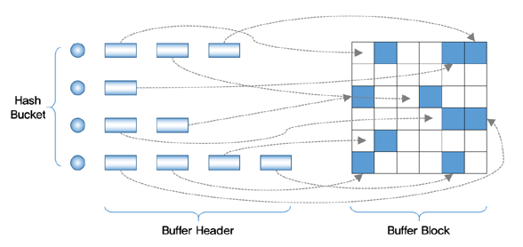
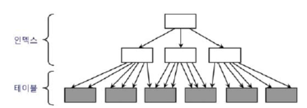
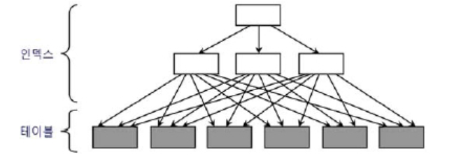
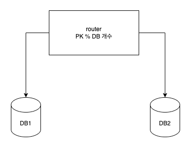
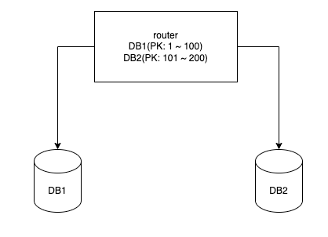
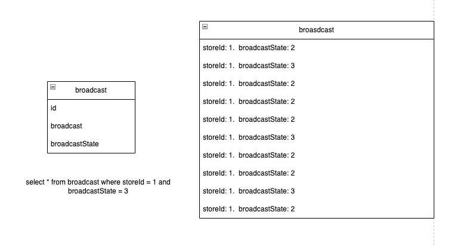
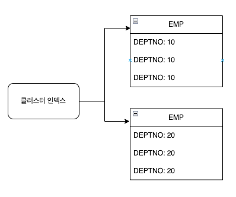

### 인덱스 ROWID

---

인덱스는 스캔한 후에 반드시 테이블을 액세스한다.

**인덱스를 스캔하는 이유**

- 검색 조건을 만족하는 소량의 데이터를 인덱스에서 빨리 찾고 거기서 테이블 레코드를 찾아가기 위한 주소값(rowId)를 얻기 위함이다.

여기서 rowId는 물리적 주소라고 할 수도 있지만 논리적 주소에 가깝다.
⇒ 테이블 레코드를 찾아가기 위한 위치 정보를 담는다. (물리적으로 포인터 처럼 위치를 가리키는게 아님)

### 메인 메모리 DB와의 비교

---

메인메모리란 메모리를 통해서만 I/O를 통해서 수행하는 DB이다.

⇒ 메인 메모리는 포인터를 가지고 있어 엄청 빠르다.

하지만 우리가 흔히 사용하는 DB들은 수시로 버퍼캐시에서 밀려났다가 다시 캐싱되고 그때마다 다른 주소로 캐싱되기 때문에 포인터로 직접 연결할 수 없는 구조로 **메모리 정보가 아닌 디스크 주소 정보(DBA)를 이용해** 해시 알고리즘으로 버퍼 블록을 찾아간다.
⇒ 그래서 메인 메모리보다 느리다.

### DB가 찾아가는 구조

---



- 해싱 알고리즘으로 버퍼 헤더에 찾아간다.
- 거기서 얻은 포인터로 버퍼 블록을 찾아간다.
- 테이블 블록을 액세스 할 때는 리프 블록에서 읽은 rowId를 통해서 DBA 정보를 얻는다.
- 테이블 full scan 할때는 익스텐트 맵을 통해서 DBA 정보를 얻는다.

⇒ 즉 결론은 rowId를 통한 테이블 액세스 구조는 생각보다 고비용 구조이다.

### 클러스터링 팩터

---

클러스터링 팩터는 값을 갖는 데이터가 서로 모여있는 정도를 의미합니다.



- 물리적으로 근접해 있으면 흩어져 있을 때보다 데이터를 찾는 속도가 빠르다.



- 반대로 흩어져 있으면 상대적으로 느리다.

⇒ 테이블 액세스량에 비해 블록 I/O가 적게 발생하기 때문이다. 그리고 I/O가 적게 발생하는 이유는 버퍼 Pinning이다.

⇒ **즉 index range scan 할 경우에 single block I/O로 가져온 하나의 블록이 다른 블록을 가리킨다면 매번 조회마다 새로운 블록을 검색하고 적재하며 버퍼 캐시에서 밀려난다.**

**버퍼 pinning이란**

테이블 액세스 할 때 래치 획득과 해시 체인 스캔 과정을 거쳐 어렵게 찾아간 테이블 블록에 대한 포인터를 해제하지 않고 일단 유지한다.

그렇다면 데이터가 어느정도일 경우에 인덱스를 사용하고 인덱스를 사용하지 말아야하나?

보통 5 ~ 20% 하지만 로우 개수와 CF에 의해 달라진다.

⇒ 많을 수록 버퍼캐시에서 찾을 가능성이 작기 때문이다.

### 손익 분기점을 극복하기 위한 기능들

---

**IOT(Index-Organized Table)**

테이블 자체가 인덱스 구조이므로 항상 정렬된 상태 유지, 테이블 레코드를 읽기 위한 추가적인 Random 액세스 불가피

**클러스터 테이블(Clustered Table)**

키 값이 같은 레코드는 같은 블록에 모이도록 저장, 클러스터 인덱스를 이용할 때는테이블 Random 액세스가 키 값별로 한 번씩만 발생, 클러스터에 도달해서는 Sequential 방식으로 스캔하기 때문에넓은 범위를 읽더라도 비효율은 없다.

**파티셔닝**

### 온라인 프로그램 vs 배치 프로그램

**온라인 프로그램**

**소량의 데이터**를 읽고 갱신하므로 인덱스를 효과적으로 활용하는 것이 중요하다.

**배치 프로그램**

보통 **대량의 데이터**를 활용한다. 그래서 full scan과 해시 조인이 유리하다.

하지만 초대용량 테이블을 full scan하면 오래 기다리고 시스템에 부담이 있다.

⇒ **파티션 전략과 병렬 처리**가 매우 중요하다.

**파티션**

**table을 파티션(partition)이라는 작은 단위로 나누어 관리하는 파티셔닝(Partitioning)기법**

- 수평 파티셔닝 ⇒ 로우를 쪼개는 것
- 수직 파티셔닝 ⇒ 컬럼을 쪼개는 것

```sql
# 파티셔닝 생성
ALTER TABLE BROADCAST PARTITION BY RANGE( TO_DAYS(HIS_TIME) ) (
PARTITION p20220201 VALUES LESS THAN (TO_DAYS('2022-02-01'))

# 파티셔닝 조회
SELECT * FROM BROADCAST PARTITION (p20220201);
```

**샤딩**

**같은 테이블 스키마를 가진 데이터를 다수의 데이터베이스에 분산하여 저장하는 기법**

⇒ DB 분산

- db장애가 전면 장애로 이어지지 않음
- 모듈러 샤딩 ⇒ PK를 모듈러 연산한 결과로 DB를 특정



- 레인지 샤딩 ⇒ PK 범위를 기준으로 DB를 특정하는 방식



### 인덱스 컬럼 추가

---

테이블 액세스 최소화를 위해 사용하는 튜닝은 인덱스에 컬럼을 추가하는 것입니다.

**문제**



- 인덱스가 storeId만 걸려있다면 오른쪽 그림처럼 broadcastState는 정렬이 안되어 있어 테이블 액세스가 많이 일어남 (CF가 안좋음)
- 인덱스가 storeId + broadcastState로 되어 있다면 broadcastState또한 정렬되어 있어 테이블 액세스가 줄어듦 (CF가 좋음)
- 하지만 비효율이 없더라도 인덱스 스캔 과정에서 얻은 데이터가 많다면 그만큼 테이블 랜덤 액세스가 많이 발생하여 성능이 느릴 수 밖에 없다.

**covered 쿼리**

- 인덱스만 읽어서 처리하는 쿼리

**covered 인덱스**

- 그 쿼리에 사용한 인덱스

**유용한 인덱스**

- include 인덱스
- 사용하진 않지만 알아두면 좋을듯?
- mysql에서는 unique, fulltext, spatital 인덱스가 있는듯?

### 인덱스 구조 테이블

IOT

테이블을 찾아가기 위한 rowId를 갖는 일반 인덱스와 달리 IOT는 그 자리에 테이블 데이터를 갖는다.

⇒ 테이블 블록에 있어야 할 데이터를 인덱스 리프 블록에 모두 저장하고 있다.

- 클러스터링 팩터를 좋게 만드는 방법 중 하나
- 같은 값을 가진 레코드들이 정렬된 상태로 모여 있으므로 랜덤 액세스가 아닌 시퀀셜 액세스 방식

**힙 구조 테이블**

일반 테이블 방식

- 데이터 입력할 때 랜덤 방식

**인덱스 구조 테이블**

IOT 테이블 방식

- 정렬 상태를 유지하며 데이터 입력

### 클러스터 테이블

**인덱스 클러스터 테이블**

클러스터 키 값이 같은 레코드를 한 블록에 모아서 저장하는 구조, 만약 한 블록에 담을 수 없다면 새로운 블록을 할당하고 클러스터 체인으로 연결한 구조

- 다중 인덱스 클러스터 테이블도 있음 ⇒ 여러 테이블 레코드를 같은 블록에 저장
- 클러스터 인덱스도 일반 b*트리 구조를 사용
- 하지만 테이블 레코드를 일일이 가리키지 않고 해당 키 값을 저장하는 첫 번째 데이터 블록을 가리킨다



클러스터 인덱스를 스캔하면서 값을 찾을 때 랜덤 액세스가 값 하나당 한번씩 밖에 발생하지 않는다.

**해시 클러스터 테이블**

해시 알고리즘을 사용해서 클러스터를 찾아간다.