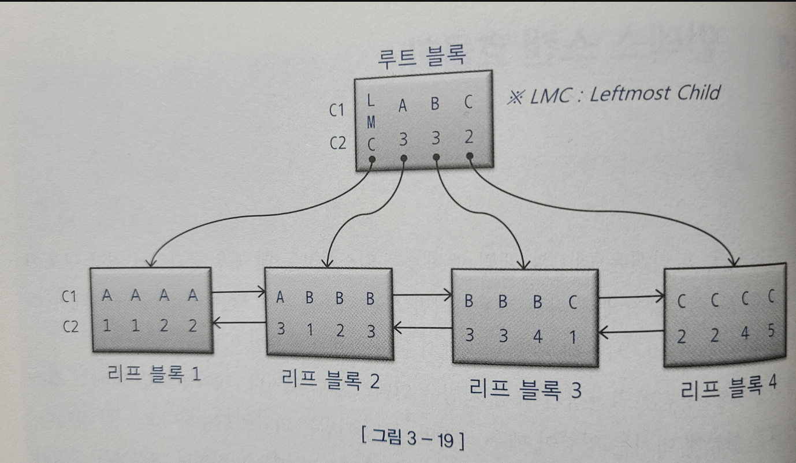

<aside>
💡 운영 환경에서 가능한 일반적인 튜닝 기법은 인덱스 컬럼 추가

</aside>

### 인덱스 탐색과정에 대해서 알아보자

---



- 루트 블록에서 LMC는 자식 노드 중에서 가장 왼쪽 끝에 위치한 블록을 가리킨다.
- 주의할 점이 C1 = ‘B’인 레코드를 찾을 때 리프블록 3으로 가는 것이 아닌 직전 리프블록 2로 가야한다.

### 각 조건절에 대해서 원리를 설명하기.

```sql
where C1 = 'B'
```

```sql
where C1 = 'B' and C2 = 3
```

```sql
where C1 = 'B' and C2 >= 3
```

```sql
where C1 = 'B' and C2 <= 3
```

```sql
where C1 = 'B' and C2 between 2 and 3
```

```sql
where C1 between 'A' and 'C' and C2 between 2 and 3
```

- 중요한 점은 스캔 시작과 끝이 중요하다.

### 인덱스 스캔 효율성

---

### 각 조건절에 대해서 원리를 설명하기.(인덱스 순서는 c1, c2, c3, c4)

```sql
where c1 = '성' and c2 = '능' and c3 = '검'
```

```sql
where c1 = '성' and c2 = '능' and c4 = '선'
```

- 아래 쿼리가 훨씬 비효율적
    - 이유는 인덱스 선행 컬럼이 조건절에 없기 때문에

### 인덱스 조건과 필터 조건

---

**인덱스 액세스 조건**

인덱스 스캔 범위를 결정하는 조건절

**인덱스 필터 조건**

테이블로 액세스할지를 결정하는 조건절

⇒ 쉽게 생각해서 첫번쨰 나타나는 범위 검색 조건까지가 인덱스 액세스 조건, 나머지가 필터 조건

### 비교 연산자 종류와 컬럼 순서에  따른 군집성

---

### 각 조건절에 대해서 원리를 설명하기.

```sql
where c1 = 1 and c2 = 'A' and c3 = '나' and c4 = 'a'
```

```sql
where c1 = 1 and c2 = 'A' and c3 = '나' and c4 >= 'a'
```

```sql
where c1 = 1 and c2 = 'A' and c3 between '가' and '다' and c4 = 'a'
```

```sql
where c1 = 1 and c2 <= 'B' and c3 = '나' and c4 between 'a' and 'b'
```

- 3번쨰 같은 경우에는 c1, c2, c3까지 인덱스 레코드가 모여있지만 그 이후는 흩어져있음
- 4번쨰 같은 경우에는 c1, c2까지 인덱스 레코드가 모여있지만 그 이후는 흩어져있음

⇒ 첫번째 나타나는 범위검색 조건까지만 만족하는 인덱스 레코드는 모두 연속해서 모여 있지만, 그 이하는 흩어져있다.

⇒ 하지만 흩어져 있는 구간도 스캔량을 줄이는데 어느정도 역할을 한다.

### 인덱스 선행 컬럼이 등치(=) 조건이 아닐 경우 비효율

---

인덱스 스캔은 모두 등치일 경우 좋다.

⇒ 인덱스 선행 컬럼이 모두 등치일 때 필요한 범위만 스캔하고 멈출 수 있는 것은, 조건을 만족하는 레코드가 모두 한데 모여 있기 때문이다.

```sql
where '아파트 시세 코드' = 'A0112345' and 평형 = '59' and type = 'a'
and 인터넷 매물 between 1 and 3
```

인덱스 선행 컬럼이 아파트 시세 코드라면? ⇒ 좁은 스캔 범위

인덱스 선행 컬럼이 인터넷 매물이라면? ⇒ 넓은 스캔 범위

### between을 in-list로 전환

---

between 대신 in list로 효과를 얻을 수도 있다.

```sql
where '아파트 시세 코드' = 'A0112345' and 평형 = '59' and type = 'a'
and 인터넷 매물 in (1, 2, 3)
```

- 수직적 탐색이 세번 발생하게 됨
- 그리고 인터넷 매물 = 1 union all 인터넷 매물 = 2 union all 인터넷 매물 = 3으로 된다.
- 아니면 index skip scan방식을 사용할 수도 있다.

**주의할 점**

- in list가 많지 않아야한다. ⇒ 많으면 수직 탐색을 많이 하게된다.
- 인덱스 스캔 과정에 선택되는 레코드들이 서로 멀리 떨어져 있을 때만 유용하다.

**index skip scan 활용**

between 조건을 in-list 조건으로 변환하면 도움이 되는 상황에서 조건절을 바꾸지 않고 효과를 낼 방법

예시) 선두 컬럼이 between 조건이어서


이런 조건일 경우 B까지 스캔하게됨

⇒ 이런 경우 skip scan을 통해서 최적화 할 수 있다.

### IN 조건은 = 인가?

결론은 in 조건은 = 이 아니다.

```sql

select * from 상품
where 고객번호 = ?
and 상품ID in ('aa1', 'aa2', 'aa3')
```

**인덱스가 상품아이디 + 고객번호라면?(204p)**

상품순으로 먼저 정렬 ⇒ 따로 따로 흩어져 있음 ⇒ in list로 하기에 적합

만약 in-list가 아니라면 테이블 전체 또는 인덱스 전체를 스캔하면서 필터링

⇒ in조건은 = 이다.

**인덱스가 고객번호 + 상품ID라면?**

같은 고객은 한 블록에 모여있음 ⇒ 고객번호 1234인 레코드를 모두 스캔한다.⇒ 수직적 탐색을 3번한다.

⇒ in 조건은 = 이 아니다.

**NUM_INDEX_KEYS 힌트 활용**

```sql
/*+ (a 고객상품 1) */
```

인덱스가 고객번호 + 상품아이디일 경우에 num_index_keys를 사용하면 세번째 인자 ‘1’은 인덱스 첫번째 컬럼까지만 액세스 조건으로 사용하라는 의미이다.

또는

```sql
where 고객번호 = ?
and RTRIM(상품아이디) in ...

where 고객번호 = ?
and 상품아이디 || in ...
```

### between과 like 스캔 범위 비교

둘다 범위 비교지만 like보다 between을 사용하는게 좋다.

```sql
where 판매월 between '201901' and '201912'
and 판매구분 = 'B'

where 판매월 like '2019%'
and 판매구분 = 'B'

where 판매월 between '201901' and '201912'
and 판매구분 = 'A'

where 판매월 like '2019%'
and 판매구분 = 'A'
```

위 4개의 조건들을 구분해보면 알게된다!(직접 생각해서 해보기)

### 범위 검색 조건을 남용할 경우 비효율

결론은 개발 편의를 위해서 범위 스캔을 하면 좋지 않다.

- 인덱스가 회사코드 + 지역코드 + 상품명

```sql
where 회사코드 = ?
and 지역코드 = ?
상품명 = like..

where 회사코드 = ?
상품명 = like..

where 회사코드 = ?
and 지역코드 like
상품명 = like..
```

위 조건들을 구분해보면 알게 된다.(직접 생각해서 해보기)

### 다양한 옵션 처리

**or 조건**

인덱스 선두 컬럼에 대한 옵션 조건에 or 조건을 사용하면 안된다.

유일한 장점은 옵션 조건 컬럼이 null 허용 컬럼이더라도 결과 집합을 보장한다.

or-expansion을 통해 인덱스를 사용 가능하다.

**like/between 조건 활용**

반드시 점검할 것들이 있다.

- 인덱스 선두 컬럼
- null 허용 컬럼 - 결과 집합에 오류가 생길수도 있음
- 숫자형 컬럼 - 자동 형변환이 일어남
- 가변 길이 컬럼 - like 옵션 조건에 사용할 때는 컬럼 값 길이가 고정적이여야 한다.

**union all 활용**

- 인덱스를 가장 최적으로 활용한다.
- 옵션 조건 컬럼도 인덱스 액세스 조건으로 사용한다.
- 고객 ID가 null 허용 컬럼이더라도 사용하는데 문제 없다.
- 유일한 단점은 코딩량이 길어진다.

**NVL, DECODE 함수 활용**

### 함수호출부하 해소를 위한 인덱스 구성

**PL/SQL 함수의 성능적 특성**

- 사용자 정의 함수는 매우 느림
- 일반 프로그래밍은 함수를 권장하지만 sql은 X
- recursive call ⇒ 조건 만족하는 회원이 100만명일 경우 함수를 100만번 실행한다. 그리고 함수 안에 있는 sql도 100만번 실행하게 된다.

**효과적인 인덱스 구성을 통한 함수호출 최소화**

인덱스 구성을 통해서 함수 호출을 최소화 할 수 있다.