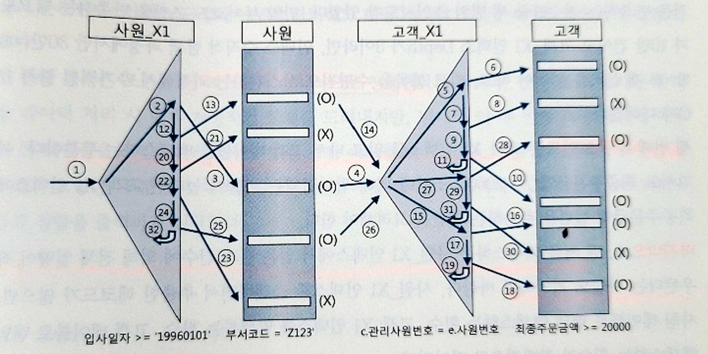

### NL 조인

**기본 메커니즘**

- NL 조인은 ‘인덱스를 이용한 조인 방식’이라고 할 수 있다

**NL 조인 실행계획 제어**

- 책에는 힌트를 사용한 조인 실행 제어가 나온다
- MySQL Join Hint 입니다! : [https://bae9086.tistory.com/279](https://bae9086.tistory.com/279)
- 근데 보통 A, B, C, D 이렇게 쿼리를 안짜지 않나 싶슴다 명시적으로 더 많이 짜는듯

**NL 조인 수행 과정 분석**

```sql
select /*+ ordered use_nl(c) index(e) index(c) */
    e.사원번호, e.사원명, e.입사일자, 
    c.고객번호, c.고객명, c.전화번호, c.최종주문금액
from 사원 e, 고객 c
where c.관리사원번호 = e.사원번호
    and e.입사일자 >= '19960101'
    and e.부서코드 = 'Z123'
    and c.최종주문금액 >= 20000
# 사원_PK : 사원번호
# 사원_X1 : 입사일자
# 고객_PK : 고객번호
# 고객_X1 : 관리사원번호 
# 고객_X2 : 최종주문금액
```



**NL 조인 튜닝 포인트**

1. 사원_X1 인덱스를 읽고나서 사원 테이블을 액세스 하는 부분
2. 고객_X1 인덱스를 탐색하는 부분
    - 인덱스를 탐색하는 부분 횟수, 즉 조인 액세스 횟수가 많을수록 성능이 느려진다
    - 만약 Index Depth가 3이라면, 인덱스 수직적 탐색 과정에서만 수많은 블록을 읽어야 하고, 리프 블록을 수평적으로 스캔하는 과정에서 추가적인 블록 I/O가 더해진다
3. 고객_X1 인덱스를 읽고 나서 고객 테이블을 액세스 하는 부분
- 맨 처음 액세스하는 사원_X1 인덱스에서 얻은 결과 건수에 의해 전체 일량이 좌우된다는 사실을 기억하자

- 올바른 조인 메소드 선택
    - 성능이 느리다면 NL 조인 튜닝 포인트에 따라 각 단계의 수행 일량을 분석해서 과도한 랜덤 액세스가 발생하는 지점을 우선 파악한다
    - 조인 순서를 변경해서 랜덤 액세스  발생량을 줄일 수 있는지, 더 효과적인 다른 인덱스가 있는지 등을 검토한다
    - 필요하다면, 인덱스 추가 또는 구성 변경도 고려해본다
    - 여러 방안을 검토한 결과 NL 조인으로 결코 좋은 ㅅ어능을 내기 어렵다고 판단될 때, 소트 머지 조인이나 해시 조인을 검토한다

**NL 조인 특징 요약**

1. 랜덤 액세스 위주의 조인 방식이다
    - 레코드 하나를 읽으려고 블록을 통째로 읽는 랜덤 액세스 방식은 설령 메모리 버퍼에서 빠르게 읽더라도 비효율이 존재
    - 인덱스 구성이 아무리 완벽해도 대량 데이터 조인할 때 NL 조인이 불리한 이유
2. 한 레코드씩 순차적으로 진행한다
    - 이 특징 떄문에 아무리 큰 테이블을 조인하더라도 매우 빠른 응답 속도를 낼 수 있다
    - 부분범위 처리가 가능한 상황에서 그럼
    - → 부분 범위 처리를 잘 활용한다면 사용자가 조회 버튼을 누르자마자 결과 집합을 출력하기 시작함
3. 다른 조인 방식과 비교할 때 인덱스 구성 전략이 특히 중요하다 → 특징임
    - 조인 컬럼에 대한 인덱스가 있느냐 없느냐, 있다면 컬럼이 어떻게 구성 됐느냐에 따라 조인 효율이 크게 달라진다

> NL 조인은 소량 데이터를 주로 처리하거나 부분범위 처리가 가능한 온라인 트랜잭션 처리(OLTP) 시스템에 적합한 조인 방식으라고 할 수 있다
>

**NL 조인 튜닝 실습**

- [https://hyeyul-k.tistory.com/14](https://hyeyul-k.tistory.com/14)

**NL 조인 확장 메커니즘**

- 오라클의 경우 버전이 올라가면서 조인 성능을 높이기 위해 테이블의 Prefecth, Batch I/O 기능이 도입되었다.
- 테이블 Prefetch
    - 인덱스를 이용해 테이블을 액세스하다가 디스크 I/O가 필요해지면, 이어서 곧 읽게 될 블록까지 미리 읽어서 버퍼캐시에 적재하는 기능.
    - 실행계획에 인덱스 rowid에 의한 Inner 테이블 액세스가 Nested Loops 위쪽에 표시되면, Prefetch 기능이 활성화됨을 의미한다.
- 배치 I/O
    - 디스크 I/O Call을 미뤘다가 일정 블록이 일정량 쌓이면 한꺼번에 처리하는 기능이다.
    - Inner쪽 인덱스만으로 조인을 하고나서 테이블과의 조인은 나중에 일괄처리하는 메커니즘으로 테이블 액세스는 나중에 하지만 부분범위처리는 정상적으로 작동한다.
    - 인덱스와의 조인을 모두 완료하고 나서 테이블을 액세스하는 것이 아니라 일정량씩 나누어 처리한다. (부분범위처리)
