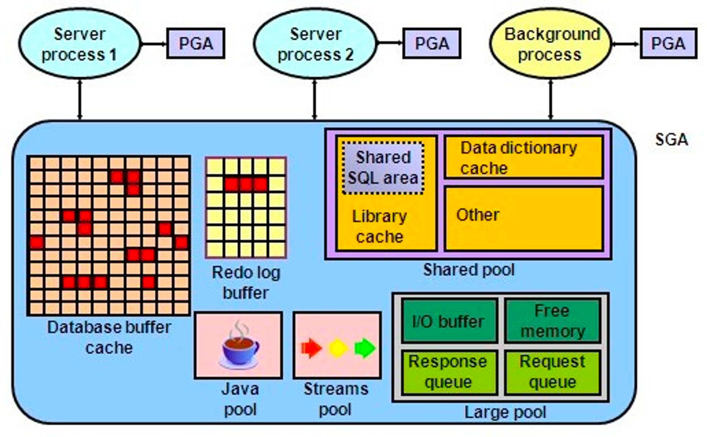

### 소트 머지 조인

**SGA vs PGA**

- SGA (System Global Area / Shared Global Area)
    - 공유 메모리 영역
    - SGA에 캐시된 데이터는 여러 프로세스가 공유할 수 있다
    - 여러 프로세스가 공유할 수 있지만 동시에 액세스할 수는 없다
    - 데이터 블록과 인덱스 블록을 캐싱하는 DB 버퍼 캐스는 SGA의 가장 핵심적인 구성 요소이며, 여기서 블록을 읽으려면 버퍼 Lock도 얻어야한다

  

- PGA (Process / Porogram / Private Global Area)
    - 각 오라클 서버 프로세스에 할당된 메모리 영역
    - 프로세스에 종속적인 고유 데이터를 저장하는 용도로 사용한다
    - 다른 프로세스와 공유하지 않는 독립적인 메모리 공간이므로 래치 메커니즘이 불필요하다
    - → 같은 양의 데이터를 읽더라도 SGA 버퍼캐시에서 읽을 때보다 훨씬 빠르다

**기본 메커니즘**

- 진행 단계
    1. 소트 단계 : 양쪽 집합을 조인 컬럼 기준으로 정렬한다
    2. 머지 단계 : 정렬한 양쪽 집합을 서모 머지(Merge)한다

```sql
select /*+ ordered use_merge(c) */
	*
from 사원 e, 고객 c
where c.관리사원번호 = e.사원번호
and e.입사일자 >= '19960101'
and e.부서코드 = 'Z123'
and c.최종주문금액 >= 20000
```

1. 아래 조건에 해당하는 사원 데이터를 읽어 조인 컬럼인 사원번호 순으로 정렬한다
    - 정렬한 결과집합은 PGA 영역에 할당된 Sort Area에 저장
    - 집합이 PGA에 담을 수 없을 정도로 크면, Temp 테이블 스페이스에 저장

    ```sql
    select 사원번호, 사원명, 입사일자
    from 사원
    where 입사일자 >= '19960101'
    and 부서코드 = 'Z123'
    order by 사원번호
    ```

2. 조인 컬럼인 고객 데이터를 읽어 조인 컬럼인 관리사원번호 순으로 정렬한다
    - 정렬한 결과집합은 PGA 영역에 할당된 Sort Area에 저장
    - 집합이 PGA에 담을 수 없을 정도로 크면, Temp 테이블 스페이스에 저장

    ```sql
    select 고객번호, 고객명, 전화번호, 최종주문금액, 관리사원번호
    from 고객 c
    where 최종주문금액 >= 20000
    order by 관리사원 번호
    ```

3. PGA(또는 Temp 테이블스페이스)에 저장한 사원 데이터를 스캔하면서 PGA(또는 Temp 테이블스페이스)에 저장한 고객 데이터와 조인한다

- 2번에서 주목할 점은, 사원 데이터를 기준으로 고객 데이터를 매번 FUll Scan하지 않는다는 사실이다
- 고객 데이터가 정렬되어 있으므로 조인 대상 레코드가 시작되는 지점을 쉽게 찾ㅇ르 수 있고, 조인에 실패하는 레코드를 만나는 순간 바로 멈출 수 있다

  


**소트 머지 조인이 빠른 이유**

- NL 조인의 치명적인 단점은 대량 데이터 조인할 때 성능이 매우 느리다는 데 있다
  → 소트 머지 조인과 해시 조인이 개발된 이유다
- NL 조인은 단적으로 말해 ‘인덱스를 이용한 조인 방식’이다
    - 조인 과정에서 액세스하는 모든 블록을 랜덤 액세스 방식으로 ‘건건이’ DB 버퍼캐시를 경유해서 읽는다.
    - 즉, 인덱스든 테이블이든, 읽는 모든 블록에 래치 획득 및 캐시버퍼 체인 스캔 과정을 거친다
- 소트 머지 조인은 양쪽 테이블로부터 조인 대상 집합을 ‘일괄적으로’읽어 PGA에 저장한 후 조인한다
    - PGA는 프로세스만을 위한 독립적인 메모리 공간이므로 데이터를 읽을 때 래치 획득 과정이 없다
      → 대량 데이터 조인에 유리한 이유

**소트 머지 조인의 주용도**

- 조인 조건식이 등치(=) 조건이 아닌 대량 데이터 조인일 때
- 조인 조건식이 아예 없는 조인(Cross Join, 카테시안 곱)

**소트 머지 조인 제어하기**

MySQL에서는 힌트말고

```sql
SELECT *
FROM orders
JOIN customers
ON orders.customer_id = customers.customer_id
ORDER BY orders.customer_id;
```

이렇게 사용하면 소트 머지 조인을 한다네요

**소트 머지 조인 특징 요약**

- 소트 머지 조인은 조인을 위해 실시간으로 인덱스를 생성하는 것과 다름없다
- 소트 부하만 감수한다면, 건건이 버퍼캐시를 경유하는 NL 조인보다 빠르다
- 조인 컬럼에 인덱스가 없는 상황에서 두 테이블을 각각 읽어 조인 대상 집합을 줄일 수 있을 때 아주 유리하다
