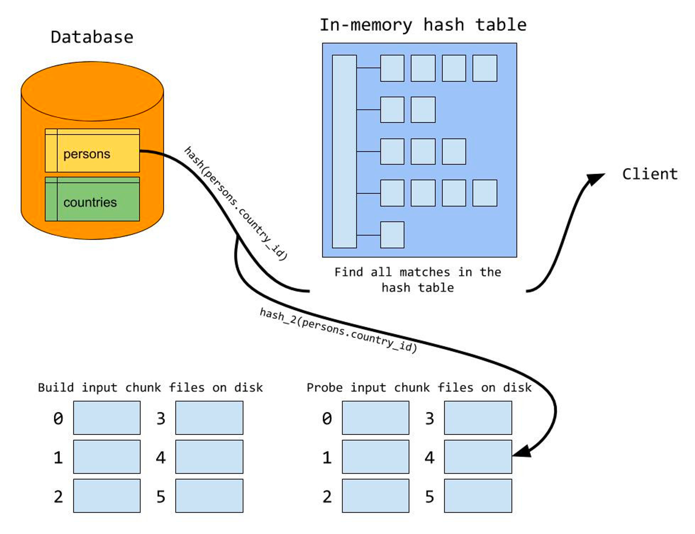
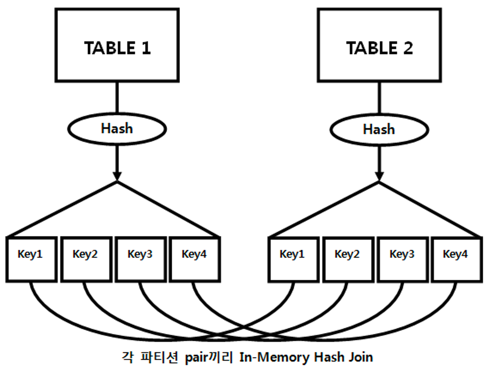

### 해시 조인

**기본 메커니즘**

- 진행 단계
    1. Build 단계 : 작은 쪽 테이블(Build Input)을 읽어 해시 테이블(해시 맵)을 생성한다
    2. Probe 단계 : 큰 쪽 테이블(Probe Input)을 읽어 해시 테이블을 탐색하면서 조인한다

```sql
select /*+ ordered use_hash(c) */
	*
from 사원 e, 고객 c
where c.관리사원번호 = e.사원번호
and e.입사일자 >= '19960101'
and e.부서코드 = 'Z123'
and c.최종주문금액 >= 20000
```

1. Build 단계
    - 아래 조건에 해당하는 사원 데이터를 읽어 해시 테이블을 생성
    - 이때, 조인 컬럼인 사원번호를 해시 테이블 키 값으로 사용한다
    - 즉, 사원번호를 해시 함수에 입력해서 반환된 값으로 해시 체인을 찾고, 그 해시 체인에 데이터를 연결한다
    - 해시 테이블은 PGA 영역에 할당된 Hash Area에 저장한다 (해시 테이블이 너무 커 PGA에 담을 수 없으면, Temp 테이블 스페이스에 저장)
2. Probe 단계
    - 아래 조건에 해당하는 고객 데이터를 하나씩 읽어 앞서 생성한 해시 테이블을 탐색한다
    - 즉, 관리사원번호를 해시 함수에 입력해서 반환된 값으로 해시 체인을 찾고, 그 해시 체인을 스캔해서 값이 같은 사원번호를 찾는다
    - 찾으면 조인에 성공한 것이고, 못 찾으면 실패한 것이다

    ```sql
    select 고객번호, 고객명, 전화번호, 최종주문금액, 관리사원번호
    from 고객 c
    where 최종주문금액 >= 20000
    ```

    - Build 단계에서 사용한 해시 함수를 Probe 단계에서도 사용하므로 같은 사원번호를 입력하면 같은 해시 값을 반환한다
    - 따라서 해시 함수가 반환한 값에 해당하는 해시 체인만 스캔하면 된다



**해시 조인이 빠른 이유**

- NL 조인은 Outer 테이블 레코드마다 Inner 쪽 테이블 레코드를 읽기 위해 래치 획득 및 캐시버퍼 체인 스캔 과정을 반복하지만, 해시 조인은 래치 획득 과정 없이 PGA에서 빠르게 데이터를 탐색하고 조인한다
- 해시 조인은, NL 조인처럼 조인 과정에서 발생하는 랜덤 액세스 부하가 없고, 소트 머지 조인처럼 양쪽 집합을 미리 정렬하는 부하도 없다
- 해시 테이블을 생성하는 비용이 수반되지만, 둘 중 작은 집합을 Build Input으로 선택하므로 대개는 부담이 크지 않다
- Build Input이 PGA메모리에 담길 때, 즉 인메모리(In-Memory) 해시 조인일 때 가장 효과적인 이유가 바로 여기에 있다
- 그렇다고 Build Input이 Hash area 크기를 초과하면 다른 조인 메소드를 선택하라는 뜻은 아니다
    - 설령  Temp 테이블스페이스를 쓰게 되더라도 대량 데이터 조인할 때는 일반적으로 해시 조인이 가장 빠르다

**대용량 Build Input 처리**

- 조인하려는 두 테이블 모두 대용량 테이블이어서 인메모리 해스 조인이 불가능한 상황일 때 DBMS는 어떤 방식으로 해시 조인을 처리할까?
- 의외로 간단하게 분할 - 정복 (Divide & Conquer) 방식이다
- 진행 단계
    1. 파티션 단계
        - 조인하는 양쪽 집합(→ 조인 이외 조건절을 만족하는 레코드)의 조인 컬럼에 해시 함수를 적용하고, 반환된 해시 값에 따라 동적으로 파티셔닝한다
        - 여러 개의 작은 서브 집합으로 분할함으로써 파티션 짝(pair)을 생성하는 단계다
        - 양쪽 집합을 읽어 디스크 Temp 공간에 저장해야하므로 인메모리 해시 조인보다 성능이 많이 떨어진다

       

    2. 조인 단계
        - 파티션 단계를 완료하면 각 파티션 짝(pair)에 대해 하나씩 조인을 수행한다
        - 각각에 대한 Build Input과 Probe Input은 독립적으로 결정된다
        - 즉, 파티션하기 전 어느 쪽이 작은 테이블이었는지 상관없이 각 파티션 짝(pair)벼롤 작은 쪽을 Build Input으로 선택하고 해시 테이블을 생성한다
        - 해시 테이블을 생성하고 나면 반대쪽 파티션 로우를 하나씩 읽으면서 해시 테이블을 탐색한다

**해시 조인 실행계획 제어**

- 테이블이 여러개일 때
    - 원리
        - 조인 연결고리를 따라 순방향 또는 역방향으로 leading 힌트에 기술한 수, Build Input으로 선택하고 싶은 테이블을 swap_join_inputs 힌트에 지정해 주면 된다
        - Build Input으로 선택하고 싶은 테이블이 조인된 결과 집합이어서 swap_join_inputs 힌트로 지정하기 어렵다면, no+swap_join_inputs 힌트로 반대쪽 Probe Input을 선택해주면 된다

- mysql hash join docs : [https://dev.mysql.com/doc/refman/8.0/en/hash-joins.html](https://dev.mysql.com/doc/refman/8.0/en/hash-joins.html)
- 책에 테이블이 2개 이상일 때 힌트도 나오는데 (leading) 위에 첨부한 문서에 테이블 여러개 힌트도 같이 나와있어욥 참고하시면 좋을것같습니다

**조인 메소드 선택 기준**

- 선택 기준
    - 소량과 대량 데이터의 기준 : NL 조인 기준으로 ‘최적화했는데도’ 랜덤 액세스가 많아 만족할만한 성능을 낼 수 없다?
    1. 소량 데이터를 조인할 때 → **NL 조인**
    2. 대량 데이터를 조인할 때 → **해시 조인**
    3. 대량 데이터 조인인데 해시 조인으로 처리할 수 없을 때, 즉 조인 조건식이 등치(=) 조건이 아닐 때(조인 조건식이 아예 없는 카테시안 곱 포함) → **소트 머지 조인**
- 수행 빈도가 매우 높은 쿼리에 대한 선택 기준
    1. (최적화된) NL 조인과 해시 조인 성능이 같으면, NL 조인
    2. 해시 조인이 약간 더 빨라도 NL 조인
    3. NL 조인보다 해시 조인이 매우 빠른 경우, 해시 조인
    - (사실 수행빈도가 높은 대량 데이터 조인은 거의 보기 어렵다… ㅇㅈ)
- 왜 NL 조인을 가장 먼저 고려해야되는가?
    - 수행시간이 짧으면서 수행빈도가 매우 높은 쿼리를 해시 조인으로 처리하면  CPU와 메모리 사용률이 크게 증가한다
    - 해시 조인은 아래 세 가지 조건을 만족하는 SQL문에 주로 사용한다
        1. 수행 빈도가 낮고
        2. 쿼리 수행 시간이 오래 걸리는
        3. 대량 데이터를 조인할 때
