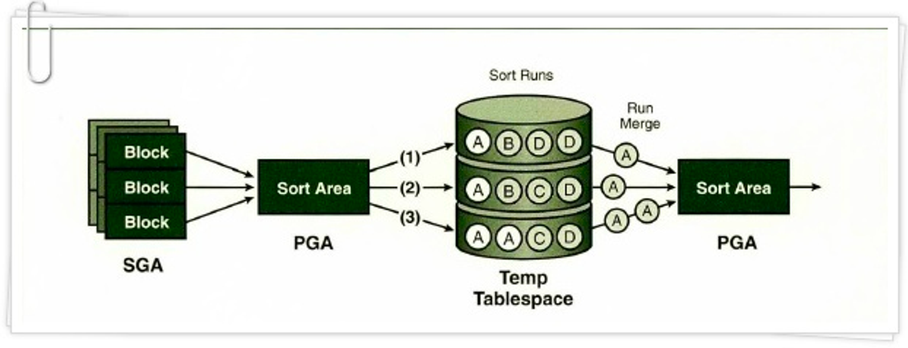

### 소트 연산에 대한 이해

**소트 수행 과정**

- 소트는 기본적으로 PGA에 할당한 Sort Area에서 이루어 진다
- 메모리 공간인 Sort Area가 다 차면, 디스크 Temp 테이블 스페이스를 활용한다
- Sort Area에서 작업을 완료할 수 있는지에 따라 소트를 두 가지 유형으로 나눈다
    - 메모리 소트(In-Memory Sort): 전체 테이터의 정렬 작업을 메모리 내에서 완료하는 것을 말하며, ‘Internal Sort’라고도 한다
    - 디스크 소트(To-Disk Sort): 할당받은 Sort Area 내에서 정렬을 완료하지 못해 디스크 공간까지 사용하는 경우를 말하며, ‘External Sort’라고도 한다
- 디스크 소트 과정

  

    1. 소트할 대상 집합을 SGA 버퍼캐시를 통해 읽어들이고, 일차적으로 Sort Area에서 정렬을 시도
    2. (Sort Runs)양이 많을 때는 정렬된 중간집합을 Temp 테이블 스페이스에 임시 세그먼트를 만들어 저장
    3. 다시 머지
- 소트 연산은 메모리 집약적(Memory-intensive)일 뿐만 아니라 CPU 집약적(CPU-intensive)이기도 하다
- 디스크 소트가 발생하는 순간 SQL 수행 성능은 나빠질 수밖에 없다
- 부분범위 처리를 불가능하게 함으로써 OLTP 환경에서 애플리케이션 성능을 저하시키는 주요인이 되기도 하다

**소트 오퍼레이션**

1. Sort Aggregate
    - 전체 로우를 대상으로 집계를 수행할 때 나타난다
    - 실제로 데이터를 정렬하진 않는다
    - Sort Area를 사용한다는 의미로 이해하면 된다
    - 데이터를 정렬하지 않고 SUM, MAX. MIN, AVG 값 구하는 절차
    1. Sort Area에 SUM, MAX, MIN, COUNT 값을 위한 변수를 각각 하나씩 할당한다
    2. 테이블에서 레코드 하나씩 읽어 내려가면서 SUM 변수에는 값을 누적하고, MAX 변수에는… (먼 느낌인지 하시죠? 연산한단 뜻)
2. Sort Order By
    - 데이터를 정렬할 때 나타난다
    - `select * from emp order by sal desc;`
3. Sort Group By
    - 소팅 알고리즘을 사용해 그룹별 집계를 수행할 때 나타난다
    - `select deptno, sum(sal), max(sal), min(sal), avg(sal) from emp group by deptno order by deptno`
    - 정렬된 그룹핑 결과를 얻고자 한다면, 실행계획에 설령 ‘Sort Group By’라고 표시되더라도 반드시 Order By를 명시해야 한다
4. Sort Unique
    - 옵티마이저가 서브쿼리를 풀어 일반 조인문으로 변환하는 것을 ‘서브 쿼리 Unnesting’이라고 한다
    - Unnesting된 서브 쿼리가 M쪽 집합ㄴ이면, 메인 쿼리와 조인하기 전에 중복 레코드부터 제거해야한다
    - 이때 Sort Unique이 발생한다
    - 만약 PK/Unique 제약 또는 Unique 인덱스를 통해 Unnesting된 서브쿼리의 유일성(Uniqueness)이 보장된다면, Sort Unique 오퍼레이션은 생략된다
    - Union, Minus, Intersect 같은 집합(Set) 연산자를 사용할 때도 Sort Unique 오퍼레이션이 나타난다
    - Distinct 연산자를 사용해도 Sort Unique 오퍼레이션이 나타난다
5. Sort Join
    - 소트 머지 조인을 수행할 때 나타난다
6. Window Sort
    - 함수(=분석 함수)를 수행할 때 나타난다
