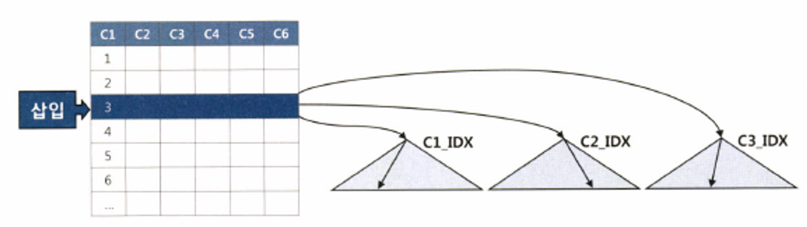
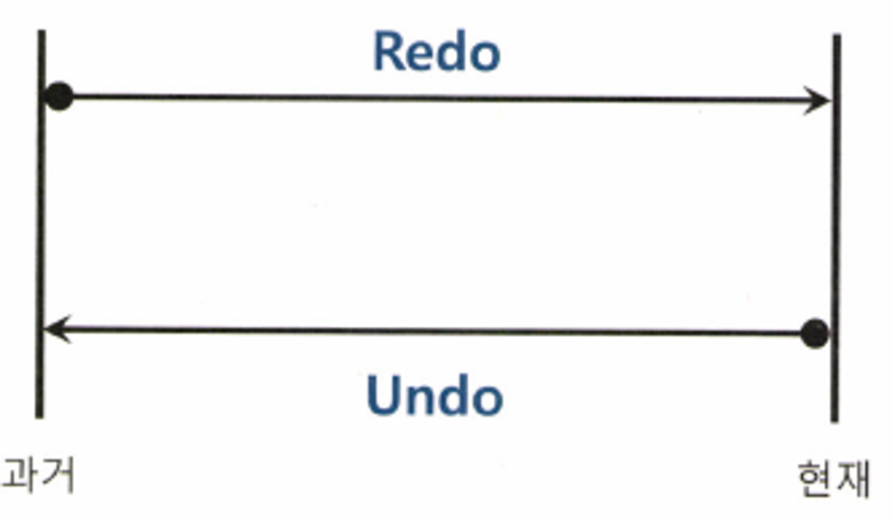
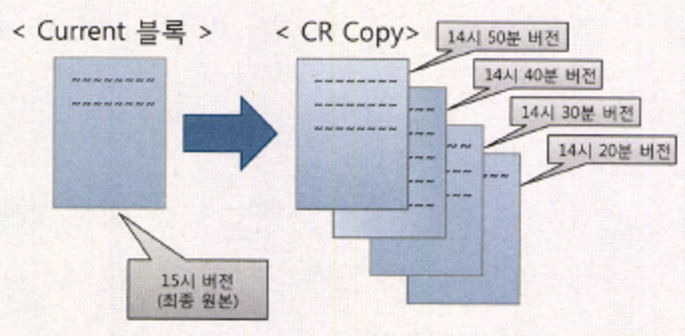
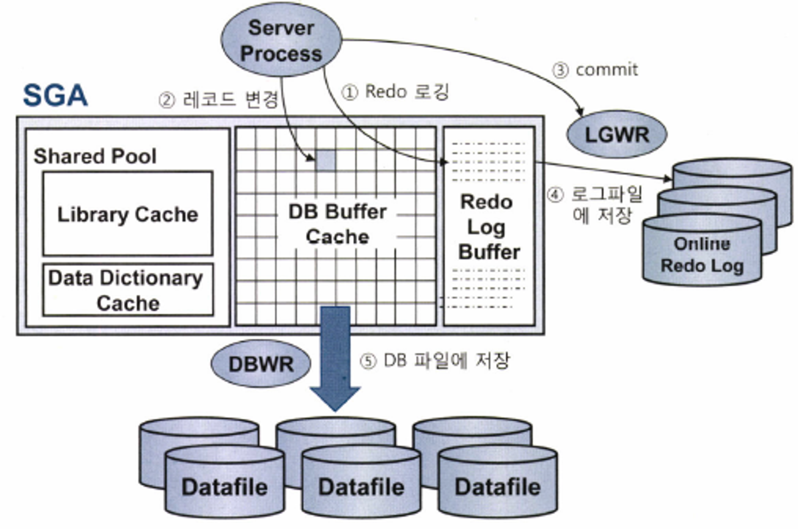

### 기본 DML 튜닝

**DML 성능에 영향을 미치는 요소**

- DML 성능에 영향을 미치는 요소
    - 인덱스
    - 무결성 제약
    - 조건절
    - 서브쿼리
    - Pedo 로깅
    - Undo 로깅
    - Lock
    - 커밋
- 인덱스와 DML 성능

  

    - 인덱스는 정렬된 자료구조이므로 수직적 탐색을 통해 입력할 블록을 찾아야 한다
    - 인덱스에 입력하는 과정이 더 복잡하므로 DML 성능에 미치는 영향도 크다
    - 핵심 트랜잭션 테이블에서 인덱스 하나라도 줄이면 TPS(Transaction Per Second)는 그만큼 향상된다
- 무결정 제약과 DML 성능
    - 데이터 무결성 규칙
        - 개체 무결성(Entity Integrity)
        - 참조 무결성(Referential Integrity)
        - 도메인 무결성(Domain Integrity)
        - 사용자 정의 무결성(또는 업무 조제약 조건)
    - DBMS에서 PK, FK, Check, Not Null 같은 제약(Constraint)을 설정하면 더 완벽하게 데이터 무결성을 지켜낼 수 있다
- 조건절과 DML 성능
    - 조건절만 포함하는 가장 기본적인 DML 문과 실행 계획은 SELECT 문과 실행계획이 크게 다르지 않으므로 인덱스 튜닝 원리를 그대로 적용할 수 있다
- 서브쿼리와 DML 성능
    - 서브쿼리를 포함하는 DML문은 SELECT 문과 실행계획이 다르지 않으므로 조인 튜닝 원리를 그대로 적용할 수 있다
- Redo 로깅과 DML 성능

  > **Redo 로깅이란?
  -** [https://dus815.tistory.com/entry/Mysql-Redo-Log-란](https://dus815.tistory.com/entry/Mysql-Redo-Log-%EB%9E%80)

  목적
    1. Database Recovery : 디스크가 깨지는 등의 Media Fail 발생 시 복구를 위함
    2. Cache Recovery (Instance Recovery 시 roll forward 단계) : 인스턴스 비정상적 종료될 때 트랜잭션 데이터 유실에 대비하기 위함
    3. Fast Commit : 사용자의 갱신 내용이 메모리상의 버퍼블록에만 기록된 채 아직 디스크에 기록되지 않았지만 Redo 로그를 믿고 빠르게 커밋을 완료한다라는 의미
  >
  >
  > 
  >
    - DML을 수행할 때 마다 Redo 로그를 생성해야 하므로 Redo 로깅은 DML 성능에 영향을 미친다
- Undo 로깅과 DML 성능

  > **Undo 로깅이란?**
  목적
    1. Transaction Rollback : 트랜잭션에 의한 변경 사항을 최종 커밋하지 않고 롤백하고자 할 때 사용
    2. Transaction Recovery (Instrance Recovery 시 rollback 단계) : Instance Crash 발생 후 Redo를 이용해 roll forward 단계가 되면 최종 커밋되지 않은 변경사항까지 모두 복구
    3. Read Consistency : ‘읽기 일관성’

  MVCC(Multi-Version Concurrency Control) 모델
  데이터를 두 가지 모드로 읽는다
    - Current 모드 : 디스크에서 캐시로 적재된 원본(Current) 블록을 현재 상태 그대로 읽는 방식
    - Consistent 모드 : 쿼리가 시작된 이후에 다른 트랜잭션에 의해 변경된 블록을 만나면 원본 블록으로부터 복사본(CR Copy) 블록을 만들고, 거기에 Undo 데이터를 적용함으로써 쿼리가 ‘시작된 시점’으로 되돌려서 읽는 방식
  >
  >
  > 
  >
    - 과거에는 롤백(Rollback)이라는 용어를 자주 사용했지만, 9i부터 오라클은 Undo라는 용어를 사용하고 있다
    - Redo는 트랜잭션을 재현함으로써 과거를 현재 상태로 되돌리는 데 사용하고, Undo는 트랜잭션을 롤백함으로써 현재를 과거 상태로 되돌리는 데 사용한다
    - Redo는 트랜잭션을 재현하는 데 필요한 정보를 로깅하고, Undo에는 변경된 블록을 이전 상태로 되돌리는 데 필요한 정보를 로깅한다
- Lock과 DML 성능
    - Lock을 필요 이상으로 자주, 길게 사용하거나 레벨을 높일수록 DML 성능은 느려진다
    - 그렇다고 Lock을 너무 적게, 짧게 사용하거나 필요한 레벨 이하로 낮추면 데이터 품질이 나빠진다
    - 이 둘은 트레이드 오프(Trade-off) 관계여서 어렵다 두 마리 토끼를 다 잡으려면 매우 세심한 동시성 제어가 필요
- 커밋과 DML 성능
    - 모든 DBM는 Fast Commit을 구현하고 있다 구현 방식은 서로 다르지만, 갱신한 데이터가 아무리 많아도 커밋만큼은 빠르게 처리한다는 점은 같다
    - 내부 메커니즘
        1. DB 버퍼캐시
            - 버퍼캐시에서 변경된 블록(Dirty 블록)을 모아 주기적으로 데이터파일에 일괄 기록한느 작업은 DBWR(Database Writer) 프로세스가 맡는다
            - 일을 건건이 처리하지 않고 모았다가 한 번에 일괄(Batch) 하는 방식
        2. Redo 로그 버퍼
            - 버퍼 캐시가 유실되더라도 Redo 로그를 이용해 언제든 복구할 수 있다
            - Redo 로그도 파일이기 때문에 디스크 I/O가 느리다
            - 성능 문제를 위해 로그 버퍼를 사용한다
        3. 트랜잭션 데이터 저장 과정
            1. DML 문을 실행하면 Redo 로그 버퍼에 변경사항을 기록한다
            2. 버퍼블록에서 데이터를 변경(레코드 추가/수정/삭제)한다 물론, 버퍼캐시에서 블록을 찾지 못하면, 데이터파일에서 읽는 작업부터 한다
            3. 커밋한다
            4. LGWR 프로세스가 Redo 로그 버퍼 내용을 로그파일에 일괄 저장한다
            5. DBWR 프로세스가 변경된 버퍼블록들은 데이터파일에 일괄 저장한다

           

        4. ‘커밋 = 저장 버튼’
            - 문서 저장과 관련해 안 좋은 습관 몇 가지
                - 문서 작성을 모두 완료할 때까지 저장 버튼을 한 번도 누르지 않는다
                - 너무 자주, 수시로 저장 버튼을 누른다
                - 습관적으로 저장 버튼을 연속해서 두 번씩 누른다
            - 커밋은 문서 작업 도중에 ‘저장’ 버튼을 누르는 것과 같다
            - 서버 프로세스가 그때까지 했던 작업을 디스크에 기록하라는 명령어인셈이다
            - 트랜잭션을 논리적으로 잘 정의함으로써 불필요한 커밋이 발생하지 않도록 구현해야한다

**데이터베이스 Call과 성능**

- 데이터베이스 Call
    - SQL 실행 단계
        - Parse Call: SQL 파싱과 최적화를 수행하는 단계, SQL과 실행 계획을 라이브러리 캐시에서 찾으면, 최적화 단계는 생략할 수 있다
        - Execute Call: 말 그대로 SQL을 실행하는 단계, DML은 이 단계에서 모든 과정이 끝나지만, SELECT문은 Fetch 단계를 거친다
        - Fetch Call: 데이터를 읽어서 사용자에게 결과집합을 전송하는 과정으로 SELECT문에서만 나타난다. 전송할 데이터가 많을 때는 Fetch Call이 여러 번 발생한다
    - Call이 어디서 발생하느냐에 따라 Call이 나뉜다
        - User Call
            - 네트워크를 경유해 DBMS 외부로부터 인입되는 Call
            - 3-Tier 아키텍처에서 User Calld은 WAS 서버에서 발생하는 Call
        - Recursive Call
            - DBMS 내부에서 발생하는 Call
            - SQL 파싱과 최적화 과정에서 발생하는 데이터 딕셔너리 조회, PL/SQL로 작성한 사용자 정의 함수/프로시저/트리거에 내장된 SQL을 실행할 때 발생하는 Call이 여기 해당한다
    - 데이터베이스 Call이 많으면 성능은 느릴 수 밖에 없다
    - 특히, 네트워크 경유하는 UserCall이 성능에 미치는 영향은 매우 크다
- 절차적 루프 처리
    - 네트워크를 경유하지 않는 Recursive Call이므로 수행 시간이 짧아진 예시가 나옴
    - 커밋과 성능
        - 커밋을 많이 했는데 수행시간이 늘어난 예시를 보여준다
        - 커밋을 자주 발행하면 트랜잭션 원자성에도 문제가 생긴다
- One SQL의 중요성
    - 업무 로직이 복잡하면 절차적으로 처리할 수밖에 없지만, 그렇지 않다면 가급적 One SQL로 구현하려고 노력해야한다
    - 수정가능 조인 뷰와 Merge 문 활용법

**Array Processing 활용**

- [http://wiki.gurubee.net/pages/viewpage.action?pageId=26279996](http://wiki.gurubee.net/pages/viewpage.action?pageId=26279996)
- Array Processing 기능을 확용하면 One SQL로 구현하지 않고도 Call 부하를 획기적으로 줄일 수 있다
- Call을 단 하나로 줄이지 못하더라도 Array Processing을 활용해 10~100번 수준으로 줄일 수 있다면 One SQL에 준하는 성능효과를 얻을 수 있다

**인덱스 및 제약 해제를 통한 대량 DML 튜닝**

- PK 제약과 인덱스 해제
    - PK 제약에 Unique 인덱스를 사용한 경우
    - PK 제약에 Non-Unique 인덱스를 사용한 경우

**수정가능 조인 뷰**

- 전통적인 방식의 UPDATE
    - 다른 테이블과 조인이 필요할 때 전통적인 UPDATE 문을 사용하면 비효율을 완전히 해소할 수 없다
- 수정가능 조인 뷰
    - 집합에 PK 제약을 설정하거나 Unique 인덱스를 생성해야 수정가능 조인 뷰를 통한 입력/수정/삭제가 가능하다
    - PK 제약을 설정하면 <EMP> 테이블은 ‘키-보존 테이블(Key-PreservedTable)’이 되고, <DEPT> 테이블은 ‘비 키-보존 테이블 (Non Key-Preserved Table)’로 남는다
- 키 보존 테이블이란?
    - 조인된 결과 집합을 통해서도 중복 값 없이 Unique 하게 식별이 가능한 테이블
    - 뷰에 rowid를 제공하는 테이블
- ++ MySQL은 데이터 수정이 가능한 뷰가 없는듯

**MERGE 문 활용**

- MERGE 문
    1. 전일 발생한 변경 데이터를 기간계 시스템으로부터 추출(Extraction)
    2. 테이블을 DW 시스템으로 전송(Transportation)
    3. DW 시스템으로 적재(Loading)
- MERGE 문 사용 (MySQL)
    - [https://yeongseungjeong.tistory.com/36](https://yeongseungjeong.tistory.com/36)
    - [https://mohading.tistory.com/22](https://mohading.tistory.com/22)
