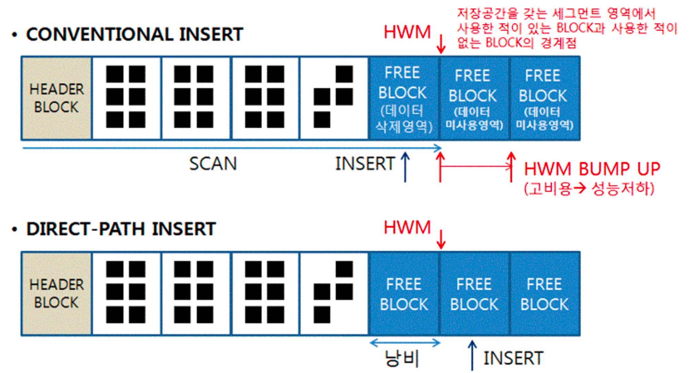

### Direct Path I/O 활용

**Direct Path I/O**

- 일반적은 블록 I/O는 DB 버퍼캐시를 경유 
  → 읽고자 하는 블록을 먼저 버퍼캐시에서 찾아보고, 찾아보지 못할 때만 디스크에서 읽음
- 데이터를 변경할 때도 먼저 블록을 버퍼캐시에서 찾음 
  → 버퍼블록에 변경을 가하고 나면, DBWR 프로세스가 변경된 블록(Drity 블록)들을 주기적으로 찾아 데이터파일에 반영해준다
- 하지만 대량 데이터를 읽고 쓸 때 건건이 버퍼캐시를 탐색한다면 개별 프로그램 성능에는 오히려 안좋다 
  → 버퍼캐시에서 블록을 찾을 가능성이 거의 없음 
  → 대량 블록을 건건이 디스크로부터 버퍼캐시에 적재하고서 읽어야하는 부담 있음 
  → 재사용성도 낮음
- 오라클은 버퍼캐시를 경유하지 않고 곧바로 데이터 블록을 읽고 쓸 수 있는 Direct Path I/O 기능을 제공
- Direct Path I/O가 작동하는 경우
    1. 병렬 쿼리로 Full Scan을 수행할 때
    2. 병렬 DML을 수행할 때
    3. Direct Path Insert를 수행할 때
    4. Temp 세그먼트 블록들을 읽고 쓸 때
    5. direct 옵션을 지정하고 export를 수행할 때
    6. nocache 옵션을 지정한 LOB 컬럼을 읽을 때

**Direct Path Insert**

- INSERT 가 느린 이유
    1. 데이터를 입력할 수 있는 블록을 Freelist에서 찾는다
       테이블 HWM(High-Water-Mark) 아래쪽에 있는 블록 중 데이터 입력이 가능한(여유 공간이 있는) 블록을 목록으로 관리하는데 이를 ‘Freelist’라고 한다
    2. Freelist에서 할당받은 불록을 버퍼캐시에서 찾는다
    3. 버퍼캐시에 없으면, 데이터파일에서 읽어 버퍼캐시에 적재한다
    4. INSERT 내용을 Undo 세그먼트에 기록한다
    5. INSERT 내용을 Redo 로그에 기록한다
- Direct Path Insert 방식을 사용하면, 대량 데이터를 일반적인 INSERT 보다 훨씬 더 빠르게 입력할 수 있다
- 데이터를 Direct Path Insert 방식으로 입력하는 방법
    - INSERT … SELECT 문에 append 힌트 사용
    - parallel 힌트를 이용해 병렬 모드로 INSERT
    - direct 옵션을 지정하고 SQL *Loader(sqlldr)로 데이터 적재
    - CTAS(create table … as select)문 수행
- Direct Path Insert 방식이 빠른 이유
    1. Freelist를 참조하지 않고 HWM 바깥 영역에 데이터를 순차적으로 입력
    2. 블록을 버퍼캐시에서 탐색하지 않는다
    3. 버퍼캐시에 적재하지 않고, 데이터 파일에 직접 기록
    4. Undo 로깅을 안한다
    5. Redo 로깅을 안하게 할 수 있다 (정확히 말하면 ‘최소화’할 수 있는거) 
       → 테이블을 `alter table t NOLOGGING;` 모드로 전환한 상태에서 Direct Path Insert 를 하면 된다 
       → 참고로 Direct Path Insert가 아닌 일반 INSERT 문을 로깅하지 않게 하는 방법은 없음
- Direct Path Insert를 사용할 때 주의점
    1. 이 방식을 사용하면 성능은 비교할 수 없이 빨라지지만 Exclusive 모드 TM Lock이 걸린다 
       → 커밋하기 전까지 다른 트랜잭션은 해당 테이블에 DML을 수행하지 못한다 
       → 트랜잭션이 빈번한 주간에 이 옵션을 사용하는 것은 절대 금물이다
    2. Freelist를 조회하지 않고 HWM 바깥 영역에 입력하므로 테이블에 여유 공간이 있어도 재활용하지 않는다 
       → 데이터를 주기적으로 DELETE 해서 여유 공간이 생겨도 이 방식으로만 계속 INSERT하는 테이블은 사이즈가 줄지 않고 계속 늘어만 간다 
       → 파티션 DROP 방식으로 지워야 공간 반환이 제대로 이루어진다

  

**병렬 DML**

- UPDATE, DELET는 기본적으로 Direct Path Wirte가 불가능
- 유일한 방법은 병령 DML로 처리하는 것
- 병렬 처리는 대용량 데이터가 전제적이므로 오라클은 병렬 DML에 항상 Direct Path Write 방식을 사용
- 병렬 DML이 작동하지 않을 경우를 대비해 append 힌트를 같이 사용하는게 좋다
- 병렬 DML이 작동하지 않더라도 QC가 Direct Path Insert를 사용하면 어느 정도 만족할 만한 성능을 낼 수 있다
- 병렬 DML이 잘 작동하는지 확인하는 방법
    - 실행계획이 UPDATE/DELETE/INSERT 가 ‘PX COORDINATOR’ 아래쪽에 나타나는지 확인

- MySQL
    - ***MySQL***에서는 모든 SQL 처리를 단일 코어에서 Nested Loop Join 방식으로만 데이터를 처리하기 때문에***병렬***처리라는 것은 없다
    - 하지만 **MySQL 8.0.14**버전에서 작게 나마 Native 병렬 쿼리를 실행할 수 있는 기능이 추가
    - [https://blogs.oracle.com/mysql/post/mysql80-innodb-parallel-threads-ddl](https://blogs.oracle.com/mysql/post/mysql80-innodb-parallel-threads-ddl)
