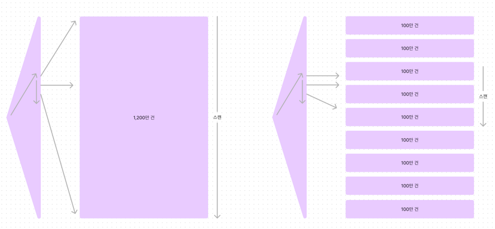
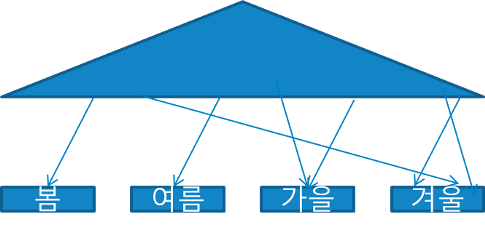
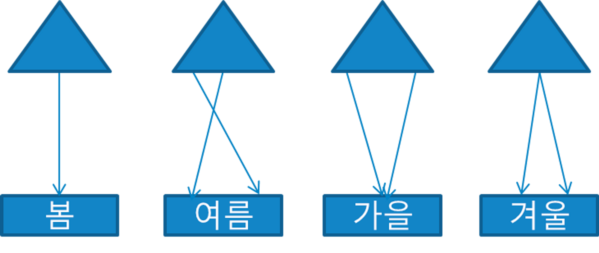

### 파티션을 활용한 DML 튜닝

**테이블 파티션**

- 파티셔닝(Partitioning) : 테이블 또는 인덱스 데이터를 특정 컬럼(파티션 키) 값에 따라 별도 세그먼트에 나눠서 저장하는 것
- 월별, 분기별, 반기별, 연별로 분할해서 저장해 두면 빠르게 조회할 수 있고, 관리하기도 쉽다
- 일반적으로 시계열에 따라 Range 방식으로 분할하지만, 그 외 다른 기준으로 분할할 수도 있다
- 파티션이 필요한 이유
    - 관리적 측면 : 파티션 단위 백업, 추가, 삭제, 변경 → 가용성 향상
    - 성능적 측명 : 파티션 단위 조회 및 DML, 경합 또는 부하 분산

파티션 종류

- Range 파티션

  

    ```sql
    CREATE TABLE `tb_test_columns_range` (`id` bigint NOT NULL AUTO_INCREMENT, ...) ENGINE=InnoDB
    PARTITION BY RANGE COLUMNS(create_time)
    (PARTITION p202111 VALUES LESS THAN ('2021-12-01') ENGINE = InnoDB,
     PARTITION p202112 VALUES LESS THAN ('2022-01-01') ENGINE = InnoDB,
     PARTITION p202201 VALUES LESS THAN ('2022-02-01') ENGINE = InnoDB,
     PARTITION p202202 VALUES LESS THAN ('2022-03-01') ENGINE = InnoDB,
     PARTITION p202203 VALUES LESS THAN ('2022-04-01') ENGINE = InnoDB,
     PARTITION p202204 VALUES LESS THAN ('2022-05-01') ENGINE = InnoDB,
     PARTITION p202205 VALUES LESS THAN ('2022-06-01') ENGINE = InnoDB);
    ```

    - 위와 같은 파티션 테이블에 값을 입력하면 각 레코드를 파티션 키 값에 따라 분할 저장하고, 읽을때도 검색조건을 만족하는 파티션만 골라 읽어줄 수 있어 이력성 데이터를 Full Scan 방식으로 조회할 때 성능을 크게 향상
    - 부관주기 정책에 따라 과거 데이터가 저장된 파티션만 백업하고 삭제하는 등 데이터 관리 작업을 효율적이고 빠르게 수행할 수 있는 장점도 있음
- 해시 파티션
    - 파티션 키 값을 해시 함수에 입력해서 반환받은 값이 같은 데이터를 같은 세그먼트에 저장하는 방식
    - 파티션 개수만 사용자가 결정하고 데이터를 분산하는 알고리즘은 오라클 내부 해시함수가 결정
    - 검색할 때는 조건절 비교 값(상수 또는 변수)에 똑같은 해시 함수를 적용함으로써 읽을 파티션을 결정
    - 해시 알고리즘 특성상 등치(=) 조건 또는 IN-List 조건으로 검색할 때만 파티션 Pruning이 작동
- 리스트 파티션

    ```sql
    create table SALES (sales_no number, ...)
    partition by list (state)
    (
      partition P_EAST    values ('MA','NY','CT','NH','ME','MD','VA','PA','NJ'),
      partition P_WEST    values ('CA','AZ','NM','OR','WA','UT','NV','CO'),
      partition P_SOUTH   values ('TX','KY','TN','LA','MS','AR','AL','GA'),
      partition P_CENTRAL values ('OH','ND','SD','MO','IL','MI','IA')
    );
    ```

    - 리스트 파티션 : 사용자가 정의한 그룹핑 기준에 따라 데이터를 분할 저장하는 방식
    - Range 파티션에선 값의 순서에 따라 저장할 파티션이 결정되지만, 리스트 파티션에서는 순서와 상관없이 불연속적인 값의 목록에 의해 결정
    - 해시 파티션과 비교하면, 해시 파티션은 오라클이 정한 해시 알고리즘에 따라 임의로 분할하는 방변, 리스트 파티션은 사용자가 정의한 논리적인 그룹에 따라 분할
    - 업무적인 친화도에 따라 그룹핑 기준을 정하되, 될 수 있으면 각 파티션에 값이 고르게 분산되도록 해야 함

(약간 인덱스 스캔이랑 비슷한 개념같다)

- MySQL 파티션
    - [https://hoing.io/archives/8527](https://hoing.io/archives/8527)

**인덱스 파티션**

- 테이블 파티션 구분
    - 비파티션 테이블(Non-Partitioned Table)

      

    - 파티션 테이블(Partitioned Table)
- 인덱스 파티션 구분
    - 비파티션 테이블(Non-Partitioned Table)
    - 파티션 테이블(Partitioned Table)
        - 로컬 파티션 인덱스(Local Partitoined index)
        - 글로벌 파티션 인덱스(Global Partitioned Index)
- 로컬 파티션 인덱스는 각 테이블 파티션과 인덱스 파티션이 서로 1:1 대응 관계가 되도록 오라클이 자동으로 관리하는 파티션 인덱스를 말함
- 로컬이 아닌 파티션 인덱스는 ‘모두’ 글로벌 파티션 인덱스이며, 테이블 파티션과 독립적인 구성을 가짐

- 로컬 파티션 인덱스

  

    - 로컬 파티션 인덱스는 구분(ex. 계절 - 봄/색인, 여름/색인…)별로 별도 색인을 만드는것과 같다

        ```sql
        -- 인덱스 생성문 마지막에 LOCAL 옵션을 주면 로컬 인덱스로 생성된다.
        create index ... LOCAL;
        ```

    - 테이블 파티션의 키가 동일하게 로컬 인덱스에 상속된다. 따라서 테이블 파티션의 키와 인덱스 파티션의 키는 동일
        - 테이블 파티션의 키가 '계절'이라면 인덱스 파티션의 키도 '계절'
    - 오라클에서 관리해주므로 테이블 파티션 구성을 변경하더라도 서비스에 영향을 거의 주지 않음
- 글로벌 파티션 인덱스

    ```sql
    -- 인덱스 생성문 마지막에 GLOBAL 옵션을 준 후, 파티션을 생성 로직을 넣으면 글로벌 파티션 인덱스로 생성된다.
    create index ... GLOBAL
    partition by range(주문금액) (
    	partition P_01 values less than (10000)
    	, partition P_MX values less than (MAXVALUE)
    );
    ```

    - 테이블 파티션과는 별개로 인덱스의 파티션을 다른 방식으로 만든다
    - 테이블 파티션이 없어도 생성 가능
    - 테이블 파티션 구성을 변경하는 순간 글로벌 인덱스를 재생성해 줘야 하므로 서비스를 중단해야 한다
    - 오라클이 인덱스 파티션을 자동으로 관리해주지 않으면 테이블과 인덱스가 1:1 관계가 되어도 로컬 파티션이 아니다 → 글로벌 파티션임

  

- 비파티션 인덱스
    - 비파티션 인덱스는 말 그대로 파티셔닝하지 않은 인덱스다 (그냥 인덱스)
    - 비파티션 인덱스는 여러 테이블 파티션을 가리킨다
    - 그런 의미에서 비파티션 인덱스를 ‘글로벌 비파티션 인덱스’라고 부르기도 한다
- Prefixed vs. Nonprefixed
    - 인덱스 파티션 키 컬럼이 인덱스 구성상 왼쪽 선두 컬럼에 위치하는지에 따른 구분
        - Prefixed : 인덱스 파티션 키 컬럼이 인덱스 키 컬럼 왼쪽 선두에 위치
        - Nonprefixed<br />
          - 인덱스 파티션 키 컬럼이 이 인덱스 키 컬럼 왼쪽 선두에 위치하지 않는다<br />
          - 파티션 키가 인덱스 컬럼에 아예 속하지 않을 때도 여기에 속한다<br />
        - 로컬 Prefixed<br />
          - 테이블 파티션의 키가 '계절'이라면 인덱스 파티션의 키도 '계절'이다<br />
          - 인덱스의 컬럼 구성을 '계절' + '온도'로 한 로컬 파티션 인덱스를 만들었다면, 파티션 키인 '계절'이 인덱스 컬럼 구성 선두에 위치하므로 이를 로컬 Prefixed라고 한다<br />
        - 로컬 Nonprefixed<br />
          - 테이블 파티션의 키가 '계절'이라면 인덱스 파티션의 키도 '계절'이다<br />
          - 인덱스의 컬럼 구성을 '온도'로 한 로컬 파티션 인덱스를 만들었다면, 파티션 키인 '계절'이 인덱스 컬럼에 아예 속하지 않으므로 이를 로컬 Nonprefixed라고 한다<br />
        - 글로벌 Prefixed<br />
          - 로컬 Prefixed와 설명 동일<br />
        - ~~글로벌 Nonprefixed~~<br />
          - 글로벌 파티션 인덱스는 Prefixed 파티션만 지원한다<br />
          - 중요한 인덱스 파티션 제약

  > Unique 인덱스를 파티셔닝하려면, 파티션 키(=테이블 파티션의 키 = 인덱스 파티션의 키)가 모두 인덱스 구성 컬럼이어야 한다
  >
    - 예를 들면 Unique 인덱스가 '주문번호'이고 파티션의 키가 '주문일자'인 로컬 파티션이 존재한다고 가정하자
    - 인덱스 파티션의 키가 '주문일자'이므로 테이블 파티션도 '주문일자'를 기준으로 파티셔닝이 되어있다
    - '주문번호'가 1234인 데이터가 들어오게 되면 중복 값이 있는지 확인하기 위해 모든 인덱스의 파티션을 다 확인해야 한다
    - 왜냐하면 인덱스 파티션의 키는 '주문일자' 이므로 '주문번호'가 1234인 값이 어디에 있는지 알 수가 없기 때문이다
    - 이렇게 되면 데이터를 Insert 할 때마다 모든 인덱스 파티션을 다 찾아봐야 한다는 게 말이 안 되기 때문에 DBMS 자체에서 당연히 존재하는 제약사항이다

**파티션을 활용한 대량 UDPATE 튜닝**

- 파티션 Exchange를 이용한 대량 데이터 변경
    - 로컬 파티션이라면, 수정된 값을 갖는 임시 세그먼트를 만들어 원본 파티션과 바꿔치기하는 방식으로 처리할 수 있다
        1. 임시 테이블을 생성. 할 수 있다면 nologging 모드로 생성
        2. 더미 데이터를 읽어 임시 테이블에 입력함녀서 상태코드 값을 수정
        3. 임시 테이블에 원본 테이블과 같은 구조로 인덱스를 생성. 할 수 있다면 nologging 모드로 생성
        4. 생성한 파티션과 임시 테이블을 Exchange 한다
        5. 임시 테이블을 Drop
        6. (nologging 모드로 작업했다면) 파티션을 Logging 모드로 전환

**파티션을 활용한 대량 DELETE 튜닝**

- DELETE가 느린 이유
    1. 테이블 레코드 삭제
    2. 테이블 레코드 삭제에 대한 Undo Logging
    3. 테이블 레코드 삭제에 대한 Redo Logging
    4. 인덱스 레코드 삭제
    5. 인덱스 레코드 삭제에 대한 Undo Logging
    6. 인덱스 레코드 삭제에 대한 Redo Logging
    7. Undo에 대한 Redo Logging
- 파티션 Drop을 이용한 대량 데이터 삭제
    - `ALTER TABLE 테이블명 DROP PARTITION p201412;`
- 파티션 Truncate를 이용한 대량 데이터 삭제

    ```sql
    -- 1. 임시 테이블을 만드는데 삭제하지 않을 데이터만 남긴다. 
    -- nologging 모드로 생성하면 더 빠르다.
    CREATE TABLE 임시 nologging AS SELECT * FROM 실제테이블 WHERE 거래일자 < '20210101' AND 상태 = '1';
    
    -- 2. 삭제 대상 테이블 파티션을 truncate 한다.
    ALTER TABLE 실제테이블 TRUNCATE PARTITION p202012;
    
    -- 3. 임시 테이블의 데이터를 실제 테이블에 Insert 한다.
    INSERT INTO 실제테이블 SELECT * FROM 임시;
    
    -- 4. 임시 테이블 드랍
    DROP TABLE 임시;
    ```

- 서비스 중단 없이 파티션을 Drop 또는 Truncate 하려면 조건을 만족해야한다
    1. 파티션 키와 커팅 기준 컬럼이 일치해야함<br />
       → ex) 파티션 키와 커팅 기준 컬럼이 모드 ‘신청일자’
    2. 파티션 단위와 커팅 주기가 일치해야함<br />
       → ex) 월 단위 파티션을 월 주기로 커팅
    3. 모든 인덱스가 로컬 파티션 인덱스이어야 함<br />
       → ex) 파티션 키는 ‘신청일자’, PK는 ‘신청일자 + 신청순번’

**파티션을 활용한 대량 INSERT 튜닝**

- 비파티션 테이블일 때
    - 비파티션 테이블에 손익분기점을 넘는 대량 데이터를 INSERT 하려면, 아래와 같이 인덱스를 Unusable 시켰다가 재생성하는 방식이 더 빠를 수 있다
        1. (할 수 있다면) 테이블을 nologging 모드로 전환
        2. 인덱스를 Unusable 상태로 전환
        3. (할 수 있다면 Direct Path Insert 방식으로) 대량 데이터 입력
        4. (할 수 있다면, nologging 모드로) 인덱스를 재생성
        5. (nologging 모드로 작업했다면) logging 모드로 전환
- 파티션 테이블일 때
    1. (할 수 있다면) 작업 대상 테이블을 nologging 모드로 전환
    2. 작업 대상 테이블 파티션과 매칭되는 인덱스 파티션을 Unusable 상태로 전환
    3. (할 수 있다면 Direct Path Insert 방식으로) 대량 데이터 입력
    4. (할 수 있다면, nologging 모드로) 인덱스를 재생성
    5. (nologging 모드로 작업했다면) logging 모드로 전환
