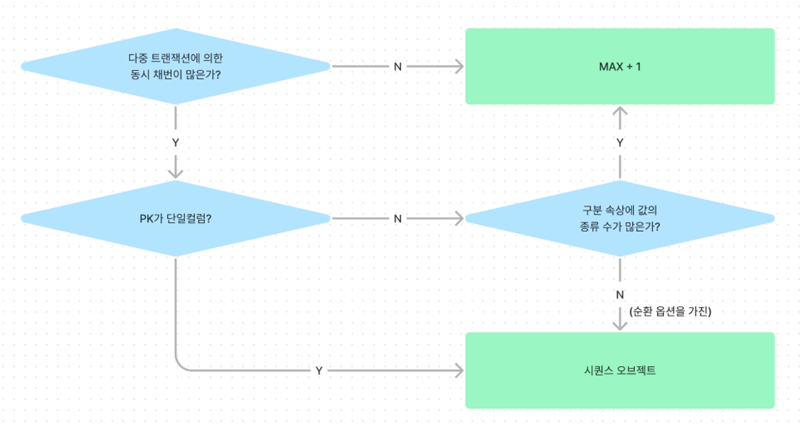

### Lock 과 트랜잭션 동시성 제거

**오라클 Lock**

- DML Lock
    - DML 로우 Lock
        - 두 개의 동시 트랜잭션이 같은 로우를 변경하는 것을 방지
        - 다른 트랜잭션이 읽고 있는 로우를 변경하려면 다음 레코드로 이동할 때까지 기다려야 하고, 다른 트랜잭션이 변경 중인 로우를 읽으려면 커밋할 때까지 기다려야 한다
    - DML 테이블 Lock
        - 오라클은 DML 로우 Lock을 설정하기 앞서 테이블 Lock을 먼저 설정한다
        - 현재 트랜잭션이 갱신 중인 테이블 구조를 다른 트랜잭션이 변경하지 못하게 막기 위해서다
        - 대상 리소스가 사용 중일 때, 진로 선택
            1. Lock이 해제될 때까지 기다린다
            2. 일정 시간만 기다리다 포기한다
            3. 기다리지 않고 작업을 포기한다
- Lock을 푸는 열쇠, 커밋
    - Blocking은 선행 트랜잭션이 설정한 Lock 때문에 후행 트랜잭션이 작업을 진행하지 못하고 멈춰 있는 상태
    - 블로킹을 해소하는 방법은 커밋(또는 롤백)뿐
    - 트랜잭션이 동시에 수행되지 않도록 애플리케이션을 설계해야 하고, DML Lock 때문에 동시성이 저하되지 않도록 적절한 시점에 커밋해야한다
    - 불필요하게 커밋을 자주 수행하면 성능이 느리다면 비동기식 커밋과 배치 커밋을 활용하는 방안을 컴토할 수 있다
        - WAIT(Default): LGWR가 로그버퍼를 파일에 기록했다는 완료 메시지를 받을 때까지 기다린다(동기식 커밋)
        - NOWAIT: LGWR의 완료 메시지를 기다리지 않고 바로 다음 트랜잭션을 진행(비동기식 커밋)
        - IMMEDIATE(Default): 커밋 명령을 받을 때마다 LGWR가 로그 버퍼를 파일에 기록
        - BATCH: 세션 내부에 트랜잭션 데이터를 일정량 버퍼링했다가 일괄 처리

        ```sql
        --- ex)
        COMMIT WRITE IMMEDIATE WAIT;
        COMMIT WRITE IMMEDIATE NOWAIT;
        COMMIT WRITE BATCH WAIT;
        COMMIT WRITE BATCH NOWAIT;
        ```


**트랜잭션 동시성 제어**

- 동시성 제어
    - 비관적 동시성 제어
        - 첫 번째 사용하자 트랜잭션을 완료하기 전까지 다른 사용자들이 같은 데이터를 수정할 수 없다
    - 낙관적 동시성 제어
        - 사용자들이 같은 데이터를 동시에 수정하지 않을 것으로 가정
          → 따라서 데이터를 읽을 때 Lock을 설정하지 않는다
- 동시성 제어 없는 낙관적 프로그래밍
    - 낙관적 동시성 제어를 사용하면 Lock이 유지되는 시간이 매우 짧아져 동시성을 높이는 데 매우 유리
    - (그냥 동시성 제어를 구현해라 문제 생기면 니탓이다.)
- 데이터 품질과 동시성 향상을 위한 제언
    - 본서는 성능을 다루는 책이지만, 성능보다 데이터 품질이 더 중요하다는 사실을 강조하지 않을 수 없다
      → 동의한다면, FOR UPDATE 사용을 두려워하지 말자
      → [https://dololak.tistory.com/446](https://dololak.tistory.com/446)
    - 불필요하게 Lock을 오래 유지하지 않고, 트랜잭션의 원자성을 보장하는 범위 내에서 가급적 빨리 커밋하자
    - 꼭 주간에 수행할 필요가 없는 배치 프로그램은 야간 시간대에 수행하자
    - 낙관적, 비관적 동시성 제어를 같이 사용하는 방법도 있다<br />
      → 일단 낙관적 동시성 제어를 시도했다가 다른 트랜잭션에 의해 데이터가 변경된 사실이 발견되면, 롤백하고 다시 시도할 때 비관적 동시성 제어를 사용하는 방식
    - 동시성을 향상하고자 할 때 SQL 튜닝은 기본이다
      → 가장 효율적인 인덱스를 구성해주고, 데이터량에 맞는 조인 메소드를 선택해야한다

**채번 방식에 따른 INSERT 성능 비교**

- INSERT, UPDATE, DELETE, MERGE 중 가장 중요하고 튜닝 요소가 많은 것은 INSERT다
- 수행빈도가 가장 높아서 그렇기도 하지만, 채번 방식에 따른 성능 차이가 매우 크기 때문

- 채번 테이블
    - 채번 테이블은 각 테이블 식별자의 단일컬럼 일련번호 또는 속성별 순번을 채번하기 위해 별도 테이블을 관리하는 방식
    - 채번 레코드를 읽어서 1을 더한 값으로 변경하고, 그 값을 새로운 레코드를 입력하는 데 사용
    - 이 방식은 채번 레코드를 변경하는 과정에 자연스럽게 액세스 직렬화(트랜잭션 줄 세우기)가 이루어지므로 두 트랜잭션이 중복 값을 채번할 가능성을 원천적으로 방지
    - 장점
        - 범용성이 좋다
        - INSERT 과정에 중복 레코드 발생에 대비한 예외(Exception) 처리에 크게 신경쓰지 않아도 되므로 채번 함수만 잘 정의하면 편리하게 사용할 수 있다
        - INSERT 과정에 결번을 방지할 수 있다
        - PK가 복합컬럼일 때도 사용할 수 있다
    - 단점
        - 다른 채번 방식에 비해 성능이 안좋다
        - 동시 INSERT가 아주 많으면 채번 레코드뿐만 아니라 채번 테이블 블록 자체에도 경합이 발생
          → 서로 다른 레코드를 변경하는 프로세스끼리도 경합할 수 있다
    - 자율 트랜잭션
        - PL/SQL의 자율(Autonomous) 트랜잭션 기능을 이용하면 메인 트랜잭션에 영향을 주지 않고 서브 트랜잭션에서 일부 자원만 Lock을 해제할 수 있다
        - PL/SQL 선언부에 `pragma automous_treansaction` 을 선언
        - 메인 트랜잭션 INSERT 문에서 아래와 같이 채번 함수를 호출하고 최종적으로 커밋하기 전까지 다른 작업을 많이 수행하더라도 채번 테이블 로우 Lock은 이미 해제한 상태이므로 다른 트랜잭션을 블록킹하지 않는다
- 시퀀스 오브젝트
    - 시퀀스(Sequence)란 자동으로 순차적으로 증가하는 순번을 반환하는 데이터베이스 객체이다
    - 장점
        - 성능이 빠르다
        - 채번 테이블과 마찬가지고 INSERT 과정에 중복 레코드 발생에 대한 예외처리에 크게 신경쓰지 않아도 된다
    - 성능에 대한 이슈
        - 시퀀스 채번 과정에서 발생하는 Lock때메 성능에 대한 이슈가 생긴다
        - 시퀀스 오브젝트는 오라클 내부에서 관리하는 채번 테이블이다
        - 시퀀스 오브젝트도 결국 테이블이므로 값을 읽고 변경하는 과정에 Lock 메커니즘이 작동
        - 이것은 캐시 사이즈를 적절히 설정하면 가장 빠른 성능을 제공할 수 있다
        - 시퀀스에는 자율 트랜잭션 기능도 기본적으로 구현돼 있다
    - 시퀀스 Lock
        - 로우 캐시 Lock<br />
          → 로우 캐시 : 딕셔너리 정보를 읽을 때 사용하는 캐시<br />
          → 로우 캐시는 공유 캐시(SGA)의 구성요소이므로 정보를 읽고 쓸 때 직렬화 해야함<br />
          → 이 때 사용하는 Lock
        - 시퀀스 캐시 Lock<br />
          → 시퀀스 캐시도 공유 캐시에 위치 그래서 얘도 직렬화 해야함 그 때 사용하는 Lock
        - SV Lock<br />
          → SV lock은 Sequence Value Lock의 약자로 RAC에서 ORDER 속성의 시퀀스 값을 보호하기 위해 사용되는 lock<br />
          → [https://12bme.tistory.com/340](https://12bme.tistory.com/340)
    - 단점
        - ‘기본적으로’ PK가 단일 컬럼일 때만 사용 가능
        - 신규 데이터를 입력하는 과정에 결번이 생길 수 있다
            1. 시퀀스 채번 이후에 트랜잭션을 롤백하는 경우
            2. CACHE 옵션을 설정한 시퀀스가 캐시에서 밀려나는 경우
            3. 자주 사용하지 않아  캐시에서 밀려나거나 인스턴스를 재기동하는 순간, 캐시되어 잇던 번호는 모두 사라지마 디스크에서 다시 읽을 때 그 다음 번호부터 읽는다
               → 사용 빈도가 낮아서 생기는 결번은 시퀀스를 Shared Pool에 KEEP하도록 명령어를 수행해 주면 됨
- MAX + 1 조회
    - 대상 테이블의 최종 일련번호를 조회하고, 거기에 1을 더해서 INSERT하는 방식

    ```sql
    INSERT INTO emp( empno
                   , ename
                   , job
                   , mgr
                   , hiredate
                   )
             VALUES( (SELECT NVL(MAX(empno), 0) + 1 FROM emp)
                   , 'GENT'
                   , 'BLOGGER'
                   , 7839
                   , TRUNC(SYSDATE)
                   )
    ```

    - 장점
        1. 시퀀스 또는 별도의 채번 테이블을 관리하는 부담이 없다
        2. 동시 트랜잭션에 의한 충돌이 많지 않으면, 성능이 매우 빠르다
        3. PK가 복합 컬럼인 경우, 즉 구분 속성별 순번을 채번할 때도 사용할 수 있다
        4. 얘는 값의 수가 많을수록 성능이 더 좋아진다<br />
           → 입력 값 중복에 의한 로우 Lock 경합이 줄고 재실행 횟수도 줄기 때문이다
    - 단점
        1. 레코드 중복에 대비한 세밀한 예외처리가 필요
        2. 다중 트랜잭션에 의한 동시 채번이 심하면 시퀀스보다 성능이 많이 나빠질 수 있다
- 책 p. 490 표



- [https://open-dba.gitbooks.io/mariadb-tips/content/chapter1.html](https://open-dba.gitbooks.io/mariadb-tips/content/chapter1.html) or trigger?
- 시퀀스보다 좋은 솔루션
    - 한 개 이상의 구분 속상과 함께 뒤쪽에 순번 대신 입력일시를 두는 방식으로 PK 구조를 설계하면, 채번 똔느 INSERT 과정에 생기는 Lock 이슈를 거의 해소할 수 있다
- 인덱스 블록 경합
    - [https://myinfrabox.tistory.com/124](https://myinfrabox.tistory.com/124)
