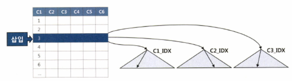
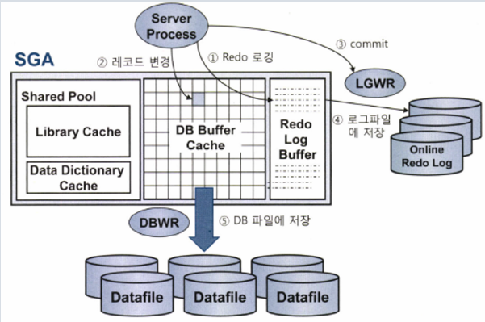

<aside>
💡 DML 성능에 영향을 주는 다른 요소와 튜닝 방법

</aside>

### DML 성능에 영향을 미치는 요소

---

- DML 성능에 영향을 미치는 요소
    - 인덱스
    - 무결성 제약
    - 조건절
    - 서브쿼리
    - Pedo 로깅
    - Undo 로깅
    - Lock
    - 커밋

**인덱스와 DML 성능**

인덱스에 입력하는 과정이 더 복잡하므로 DML 성능에 미치는 영향이 크다. (삽입, 삭제)


그렇기 때문에 인덱스 하나라도 줄이면 TPS는 그만큼 향상된다.

**무결성 제약과 DML 성능**

- 개체 무결성(Entity Integrity)
- 참조 무결성(Referential Integrity)
- 도메인 무결성(Domain Integrity)
- 사용자 정의 무결성(또는 업무 조제약 조건)

PK, FK, NOTNULL 등 제약을 설정하면 완벽하게 데이터 무결성을 지킬 수 있다.

하지만 PK, FK는 실제 데이터를 조회해야하기 때문에 성능에 큰 영향을 미친다.

**REDO로깅과 DML 성능**

모든 변경사항을 redo 로그에 기록한다.

데이터가 유실됐을 떄 트랜잭션을 재현함으로써 유실 이전 상태로 복구하는데 사용한다.

DML 수행할 때마다 redo 로그를 생성해야 하므로 DML 성능에 영향을 미친다.

목적 3가지

- database recovery
- cache recovery
- fast commit

UN**DO로깅과 DML 성능**

변경된 블록을 이전 상태로 되돌리는데 필요한 정보를 로깅한다.

DML 수행할 때마다 redo 로그를 생성해야 하므로 DML 성능에 영향을 미친다.

**UNDO의 용도와 MVCC 모델**

용도

1. 트랜잭션에 의한 변경사항을 최종 커밋하지 않고 롤백하고자 할 때 undo 데이터를 이용한다.
2. instance crash 발생 후 redo를 이용해 roll forward 단계가 완료되면 최종 커밋되지 않은 변경사항까지 모두 복구된다.
3. 일관성

mvcc 모델 (2가지 모드)

1. current모드 ⇒ 디스크에서 캐시로 적재된 원본 블록을 현재 상태 그대로 읽는 방식
2. consistent 모드 ⇒ 쿼리가 ‘시작된 시점’으로 되돌려서 읽는 방식

**Lock 과 DML 성능**

Lock을 필요 이상으로 자주, 길게 사용하거나 레벨을 높일수록 DML 성능은 느려진다

하지만 lock을 너무 짧게 사용하거나 필요한 레벨 이하로 낮추면 데이터 품질이 나빠진다.

**커밋과 DML 성능**

DML을 끝내려면 커밋까지 완료해야 하므로 서로 밀접한 관련이 있다.

모든 DBMS fast commit을 구현하고 있다. 이것은 결코 가벼운 작업이 아니다. 커밋의 내부 메커니즘을 확인해보자.

1. db 버퍼 캐시
  1. 변경된 블록을 모아 주기적으로 데이터 파일에 일괄 기록하는 작업
2. redo 로그 버퍼
  1. 버퍼캐시에 가한 변경사항을 redo 로그에도 기록
  2. 언제든지 복구 가능
  3. 디스크 I/O여서 느림 ⇒ 로깅 성능 문제를 해결하기 위해 로그 버퍼를 이용한다.
3. 트랜잭션 데이터 저장 과정

   

  1. redo 로그 버퍼에 변경사항 기록
  2. 버퍼 블록에서 데이터를 변경, 만약 버퍼캐시에서 블록을 못찾으면 데이터 파일에서 읽음
  3. 커밋
  4. LGWR 프로세스가 redo 로그버퍼 내용을 로그파일에 일괄 저장
  5. DBWR 프로세스가 변경된 버퍼 블록들은 데이터 파일에 일괄 저장
4. 커밋 = 저장버튼
  1. 서버 프로세스가 그때까지 했던 작업을 디스크에 기록하라는 명령어
  2. sync 방식, disk 방식(redo 로그 작성)으로 느리다.
  3. 트랜잭션을 논리적으로 잘 정의함으로써 불필요한 커밋이 발생하지 않도록 구현해야한다

### 데이터 베이스 call과 성능

---

**데이터베이스 Call**

1. parse call
  1. SQL 파싱과 최적화를 수행하는 단계
2. execute call
  1. SQL 실행하는 단계
3. fetch call
  1. 사용자에게 결과집합을 전송하는 과정으로 select 문에서만 나타남
4. user call
  1. DBMS 외부로부터 인입되는 call
  2. 3-Tier 아키텍처에서 User Calld은 WAS 서버에서 발생하는 Call
5. recursive call
  1. DBMS 내부로부터 발생하는 call
  2. 딕셔너리 조회, PL/SQL로 작성한 사용자 정의 함수/프로시저/트리거에 내장된 SQL

**커밋과 성능**

- 커밋이 자주 발생하면 트랜잭션 원자성에도 문제가 생김
- 커밋을 너무 안하면 undo 공간 부족으로 시스템에 부작용

⇒ 적절하게 사용

**One SQL의 중요성**

- 업무 로직이 복잡하면 절차적으로 처리할 수밖에 없지만, 그렇지 않다면 가급적 One SQL로 구현하려고 노력

### **Array Processing 활용**

---

Array Processing 기능을 확용하면 One SQL로 구현하지 않고도 Call 부하를 획기적으로 줄일 수 있다

즉 bulk insert ⇒ JPA에서 ARepository.insertAll 과 같은 역할일것 같다.

### **인덱스 및 제약 해제를 통한 대량 DML 튜닝**

---

무결성 제약 조건은 DML 성능에 큰 영향을 끼친다.

배치 프로그램에서는 제약조건이 없다면 큰 성능 개선 효과가 있을 수 있다.

### **수정가능 조인 뷰**

---

참조 테이블과 두번 조인하는 비효율을 없앨 수 있다.

### MERGE 문 활용

---

신규 트랜잭션 데이터를 반영함으로써 두 시스템 간 데이터를 동기화 하는 작업 (단일 테이블에 KEY 값을 비교하여 만약 키값이 동일하다면, UPDATE문을 동일하지 않다면 INSERT를 해주는 쿼리문. ~~사용해본 적이 없네요..~~)

### 수정 가능 조인뷰 vs merge

---

```sql
merge into emp t2
using (select T.rowID, S.ename
				from emp T, emp_src S
				where T.EMPNO = S.EMPNO
			) S
on T2.rowid = S.rid
```

- update 대상 건수를 쉽게 확인할 수 있어서 많이 사용한다.
- 하지만 성능이 좋지 않다.
- update 대상 테이블인 EMP에 두번 액세스 하기 때문이다.

update를 위해 merge문을 사용할지, update문을 사용할 지 생각해보고 사용하자.