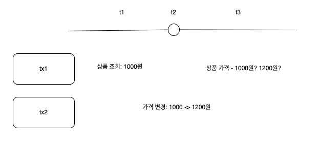

<aside>
💡 lock 메커니즘에 대해 알아보자
자세하게는 책을 참고~

</aside>

### 오라클 Lock

---

**DML 로우 lock**

두개의 동시 트랜잭션이 같은 로우를 변경하는 것을 방지한다.

- DML 로우 락에는 배타적 모드를 사용하므로 update 또는 delete를 진행중인 로우를 다른 트랜잭션이 update 하거나 delete 할 수 없다.
- insert에 대한 로우 락 경합은 unique 인덱스가 있을 때만 발생한다. ⇒ 두 트랜잭션이 같은 값을 입력하려고 할 떄 블로킹 발생
- unique키가 없거나 트랜잭션이 서로 다른 값을 입력하면 insert에 대한 로우 락 경합이 일어나지 않음

**오라클과 다른 lock의 차이점**

|  | 오라클 (MVCC 모델) | 그 외(MVCC 아닌것) |
| --- | --- | --- |
| select | lock을 사용하지 않음 | lock을 사용함, 공유 lock 끼리는 호환됨 |

**DML 테이블 Lock**

오라클

- 로우 lock을 설정하기에 앞서 테이블 lock을 먼저 설정
- 테이블 lock에는 여러가지 모드가 있다.
    - null, rs(row share), rx(row exclusive), s(share), srx(share row exclusive), x(exclusive)
- 테이블 락은 어떤 모드를 사용했는지에 따라 후행 트랜잭션이 수행할 수 있는 작업의 범위가 결정된다.

MariaDB

- shared lock (s)
    - select를 하기 위해 사용되는 lock, 조회를 위해 사용되는 lock
- exclusive lock (x)
    - 데이터 변경 시 사용되는 lock(update, delete)
    - select, update, delete 모두 변경될 데이터에 접근하지 못한다.
    - isolation level에 따라 트랜잭션의 접근허용 여부가 달라진다.

  | isolation level | dirty read | non-repeatable read | phantom-read |  |
      | --- | --- | --- | --- | --- |
  | read-uncommitted | o | o | o | 변경 되고 있을 경우에도 모두 접근 허용 |
  | read-committed | x | o | o | 반복되는 조회는 보장이 안됨 |
  | repeatable-read | x | x | o(mariadb에서는 x) | 반복되는 조회는 보장이 안됨 |
  | serializable | x | x | x |  |
    - 출처

      [https://dbknowledge.tistory.com/23](https://dbknowledge.tistory.com/23)

      [https://www.postgresql.kr/blog/pg_phantom_read.html](https://www.postgresql.kr/blog/pg_phantom_read.html)


**lock을 푸는 열쇠 - 커밋**

블로킹 - lock때문에 후행 트랜잭션이 진행하지 못하는것

교착상태 - lock을 설정한 상태에서 맞은편 트랜잭션이 lock을 설정한 리소스에 lock을 설정한것

교착상태 예시(user - order 순으로 트랜잭션 - order - user 순으로 트랜잭션)

- 불필요하게 트랜잭션을 길게 정의하지 않도록 주의해야한다.
- 불필요하게 커밋을 자주 수행하면 서버 프로세스가 LGWR에게 로그 버퍼를 비우도록 요청하고 동기 방식으로 기다리는 횟수가 늘기 때문에 기본적으로 성능이 느려진다.

### 트랜잭션 동시성 제어

---

**비관적 동시성 제어**

- 사용자들이 같은 데이터를 동시에 수정할 것으로 가정한다.
- 그래서 사용자가 데이터를 읽는 시점에 lock을 걸고 조회 또는 갱신처리가 완료될 때까지 이를 유지한다.
- 동시성을 심각하게 떨어뜨릴 유려가 있지만 update에 wait, nowait 옵션을 사용하면 Lock을 얻기 위해 무한정 기다리지 않아도 된다.

**낙관적 동시성 제어**

- 사용자들이 데이터를 동시에 수정하지 않을 것으로 가정한다.
- 따라서 lock을 설정하지 않는다.

**동시성 제어 없는 낙관적 프로그래밍**

예시


```java
```
@Transactional(readOnly = true)
public BroadcastInfoWithTransmitResponse getBroadcastWithTransmit(Long broadcastId, Long storeId) {

		// 1
		// try {
    //     Thread.sleep(5000);
    // } catch (InterruptedException e) {
    //     System.out.println("e = " + e);
    // }

    Category category = categoryRepository.findCategoryById(broadcast.getCategoryId())
            .orElseThrow(() -> new BusinessException(ErrorCode.NOT_EXIST_CATEGORY));
    
		// 2
    try {
        Thread.sleep(5000);
    } catch (InterruptedException e) {
        System.out.println("e = " + e);
    }
}
```
```

- 1번에서 category 조회하기 전에 category가 변경되었다면 → 변경된 category가 조회됨
- 2번에서 category 조회 한 후에 category가 변경되었다면 → 실제로는 변경이 되었지만 변경 전의 category가 조회됨

**동시성 향상**

- 데이터 품질이 더 중요하다.
- for update 사용을 두려워하지 말자
- 불필요하게 lock을 오래 유지하지 않고, 트랜잭션의 원자성을 보장하는 범위 내에서 빨리 커밋하자
- 낙관적, 비관적 제어를 같이 사용 ⇒ 낙관적을 사용하고 → 문제가 생길 경우 비관적 사용
- 동시성을 향상시키고자 할 때 sql 튜닝은 기본이다.

### 채번 방식에 따른 insert 성능 비교

---

insert는 수행빈도가 높고 채번 방식에 따른 성능 차이가 크다.

- 채번 테이블
- 시퀸스 오브젝트
- max + 1 조회

**채번 테이블**

테이블 식별자의 단일 컬럼 일련번호 또는 구분 속성별 순번을 채번하기 위해 별도 테이블 관리하는 방식

장점

- 범용성이 좋음
- insert 과정에서 중복 레코드 발생에 대한 예외 처리에 신경쓰지 않아도 됨

단점

- 성능이 좋지 않다. (채번 레코드를 변경하기 위한 (lock 경합 때문에))

**시퀸스 오브젝트**

장점

- 성능이 좋다. (하지만 성능 이슈가 없진 않다. - lock 때문에)
- insert 과정에서 중복 레코드 발생에 대한 예외 처리에 신경쓰지 않아도 됨

단점

- PK가 단일 컬럼일 때만 사용 가능하다. ⇒ 복합컬럼이면 최소성(각 레코드를 유일하게 식별하는 최소 컬럼으로 PK 구성해야한다.)을 위반
- 신규 데이터를 입력하는 과정에 결번이 생길 수 있다.

**MAX + 1**

최종 일련번호를 조회하고 거기에 1을 더해서 insert 하는 방식

장점

- 별도의 테이블 관리하는 부담이 없다.
- 트랜잭션에 의한 충돌이 별로 없다.
- PK가 복합이여도 사용가능하다.

단점

- 세밀한 예외처리가 필요
- 동시 채번이 심하게 되면 시퀸스보다 성능이 나빠질 수 있다.- 레코드 중복에 의한 로우 lock 경합 때문이다.

### 결론

---

1. 다중 트랜잭션에 의한 동시 채번이 많지 않으면 아무거나 사용가능하지만 가급적 MAX + 1 사용
2. 다중 트랜잭션에 의한 동시 채번이 많고 PK가 단일 컬럼 일련번호라면 시퀸스 방식
3. 다중 트랜잭션에 의한 동시 채번이 많고 PK 구분 속성에 값 종류 개수가 많으면 중복에 의한 로우 lock 경합 및 재실행 가능성이 낮음 ⇒ 시퀸스보다 MAX + 1
4. 다중 트랜잭션에 의한 동시 채번이 많고 PK 구분 속성에 값 종류 개수가 적으면 시퀸스 방식