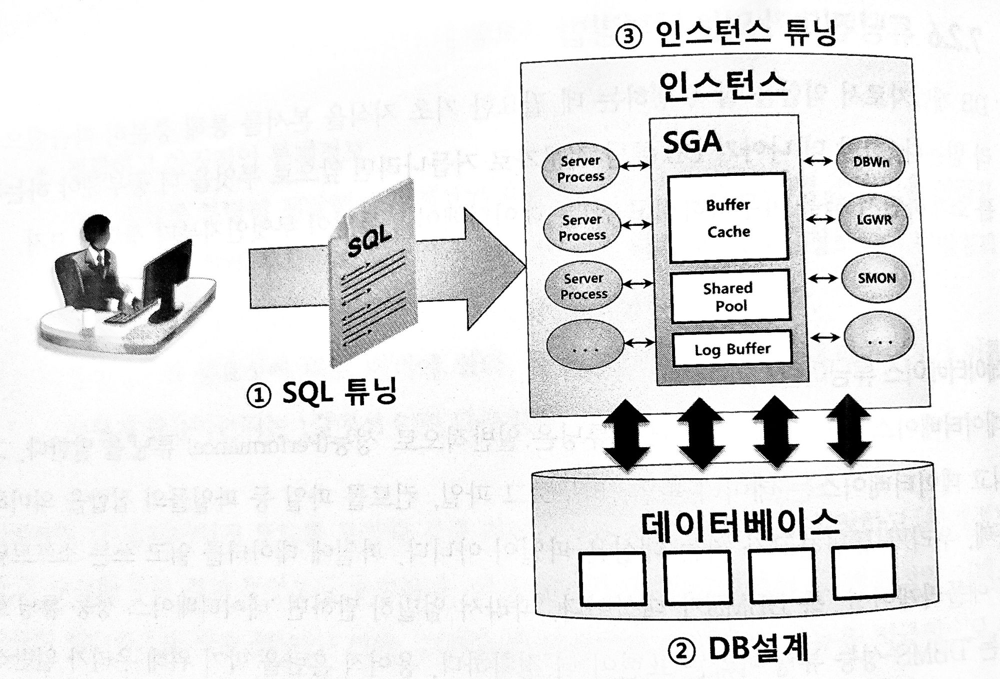

### 옵티마이저에 대한 이해

> SQL 옵티마이저와 자동차 내비게이션은 여러모로 흡사하다
실생활에서 흔히 사용하는 자동차 내비게이션과 비교하면서 SQL 옵티마이저에 대한 이해를 넓혀보자
>

**옵티마이저 종류**

- 비용기반(Cost-Based) 옵티마이저(이하 ‘CBO’)는 사용자 쿼리를 위해 후보군이 될만한 실행계획들을 도출하고, 데이터 딕셔너리(Data Dictionary)에 미리 수집해 둔 통계정보를 이용해 각 실행계획의 예상비용을 산정하고, 그중 가장 낮은 비용의 실행계획 하나를 선택하는 옵티마이저이다
- 규칙기반(Rule-Based) 옵티마이저(이하 ‘RBO)는 데이터 특성을 나타내는 통계정보를 전혀 활용하지 않고 단순한 규칙에만 의존하기 때문에 대량 데이터를 처리하는 데 부적합하다
    - RBO가 사용하는 규칙 (우선순위)
      → 순위를 결정하는 주요소는 인덱스 구조, 연산자, 조건절 형태이다
      → 하지만 오늘날 대용량 데이터베이스 환경에서는 전혀 대안이 될 수 없다
        1. Single Row by Rowid
        2. Single Row by Cluster Join
        3. Single Row by Hash Cluster Key with Unique or Primary Key
        4. Single Row by Unique or Primary Key
        5. Clusterd Join
        6. Hash Cluster Key
        7. Indexed Cluster Key
        8. Composite Index
        9. Single-Column Indexes
        10. Bounded Range Search on Indexed Columns
        11. Unbouned Range Search on Indexed Columns
        12. Sort Merge Join
        13. MAX or MIN of Indexed Column
        14. ORDER BY on Indexed Column
        15. Full Table Scan
    - 오라클도 CBO만 지원한다고 선언했으므로 뒤를 돌아보지 말자 ㅋㅋ
    - CBO는 ALL_ROWSDHK FIRST_ROWS, 두 가지 유형의 옵티마이저모드를 두고 있다 (대용량 저리를 위한)

**옵티마이저 모드**

| 네비게이션             | 비용기반 옵티마이저               |
|-------------------|--------------------------|
| 고속도로 우선 : 이동시간 단축 | ALL_ROWS : 전체 처리속도 최적화   |
| 일반도로 우선 : 통행료 절감  | FIRST_ROWS : 최초 응답속도 최적화 |
| 최단거리 : 유류비 절감     | 최초 N건 응답속도 최적화           |
- ALL_ROWS
    - 쿼리 결과집합 ‘전체를 읽는 것을 전제로’ 시스템 리소스를 가장 적게 사용하는 실행계획을 선택
    - 즉, 전체 처리속도 최적화가 목표
- FIRST_ROWS (deprecated)
    - 전체 결과집합 중 ‘앞쪽 일분만 읽다가 멈추는 것을 전제로’ 응답 속도가 가장 빠른 실행계획을 선택
    - 즉, 최초 응답 속도 최적화가 목표
    - ALL_ROWS와 비교하면, Table Full Scan보다 인덱스를 더 많이 선택하고, 해시 조인, 소트 머지 조인보다 NL 조인을 더 많이 선택하는 경향을 보인다
- FIRST_ROWS_N
    - FIRST_ROWS 대신 사용하는 옵티마이저 모드이다
    - 사용자가 ‘앞쪽 N개 로우만 읽고 멈추는 것을 전제로’ 응답 속도가 가장 빠른 실행계획을 선택한다
    - FRIST_ROWS는 사용자가 데이터를 어느 정도 읽다가 멈출지를 지정하지 않았으므로 정확한 비용 산정이 어렵다 (FRIST_ROWS_N은 1, 10, 100, 1000 으로 네 가지 중에 하나로 지정할 수 있다)
    - 반면, FIRST_ROWS_N은 읽을 데이터 건수를 지정하였으므로 더 정확한 비용 산정이 가능하다

**옵티마이저에 영향을 미치는 요소**

1. SQL과 연산자 형태
    - 결과가 같더라도 SQL을 어떤 형태로 작성했는지 또는 어떤 연산자를 사용했는지에 따라 옵티마이저가 다른 선택을 할 수도 있고, 궁극적으로 쿼리 성능에 영향을 미친다
2. 인덱스, IOT, 클러스터, 파티션, MV 등 옵티마이징 팩터
    - 쿼리를 똑같이 작성해도 인덱스, IOT, 클러스터, 파티션, MV 등을 구성했는지, 그리고 어떤 식으로 구성했는지에 따라 실행계확과 성능이 크게 달라진다
3. 제약 설정
    - 제약 설정은 데이터 무결성을 보장해 줄뿐만 아니라 옵티마이저가 쿼리 성능을 최적화하는 데 매우 중요한 메타 정보로 활용된다
4. 통계정보
    - 통계 정보는 옵티마이저에 매우 강력한 영향을 미친다
    - 잘 작동하던 프로그램이 어느 날 갑자기 느려졌다면 십중팔구는 통계정보가 원인이다
5. 옵티마이저 힌트
    - 옵티마이저에게 가장 절대적인 영향을 미치는 요소는 힌트다
    - 옵티마이저는 힌트를 명령어로 인식하고 그대로 따른다
    - 만약 힌트가 잘 작동하지 않는다면, 아래 경우에 해당할 가능성이 높다
        1. 문법적으로 맞지 않게 힌트를 기술
        2. 잘못된 참조 사용
        3. 의미적으로 맞지 않게 힌트를 기술
        4. 논리적으로 불가능한 액세스 경로
        5. 버그
6. 옵티마이저 관련 파라미터
    - 버전을 업그레이드하면 옵티마이저가 다르게 작동하는 경험을 흔히 한다
    - 옵티마이저의 그런 행동 변화는 대개 파라미터 추가 또는 기본값 변경에 기인한다

**옵티마이저의 한계**

**개발자의 역할**

> 안내사항이 실제 도로상황과 다를 수 있으니 이 시스템은 참고용으로 사용하십시오
>
- 데이터베이스 세계에서도 불완전한 옵티마이저에만 의존할 것이 아니라 개발자 스스로 옵티마이저가 되어야 한다
- 기본적으로 옵티마이저에게 많은 일을 맡기는 RDBMS 환경에서 SQL 성능을 높이기 위해 개발자가 할 일은 다음과 같다
    1. 필요한 최소 블록만 읽도록 쿼리 작성
        - SQL 작성자 스스로 결과 집합을 논리적으로 잘 정의하고, 그 결과집합을 만들기 위해 DB 프로세스가 최소한의 일만 하도록 쿼리를 효율적으로 작성하는 것이 무엇보다 중요하다
    2. 최적의 옵티마이징 팩터를 제공한다
        - 대표적인 옵티마이징 팩터
            - 전략적인 인덱스 구성
                - 인덱스를 전략적으로 구성해 줄 책임이 DBA가 아닌 개발팀에 있다
                - 인덱스는 항상 SQL 조건절을 기준으로 설계해야 하는데, 어떤 테이블을 어떤 조건으로 자주 액세스하는지는 DBA보다 개발자가 훨씬 잘 안다
                - 인덱스와 SQL 수행 원리를 개발자가 더 많이 공부해야 하는 이유가 여기에 있다
            - DBMS가 제공하는 다양한 기능 활용
                - 인덱스 외에도 DBMS가 제공하는 다양한 기능을 적절히 활용할 줄 알아야 한다
                - 파티션, 클러스터, IOT, Mv, Result Cache 등 DBMs가 제공하는 기능들을 적극적으로 활용한다면 옵티마이저에게 강력한 무기가 된다
            - 옵티마이저 모드 설정
                - 아무리 강력한 무기를 갖추었더라도 전략과 목표가 명확하지 않으면 효과적으로 싸우기 어렵다
            - 정확하고 안정적인 통계 정보
        - 정리
            1. 옵티마이저 모드를 포함해 각종 파라미터를 적잘한 값으로 설정하고, 통계 정보를 잘 수집해 주는 것이 무엇보다 중요
            2. 전략적인 인덱스 구성이 필수적으로 뒷받침
            3. DBMS가 제공하는 기능을 적극적으로 활용해 옵티마이저가 최적의 선택을 할 수 있도록 다양한 수단을 제공
    3. 필요하다면, 옵티마이저 힌트를 사용해 최적의 액세스 경로로 유도한다
        - 옵티마이저가 최적의 실행계획을 수립하지 못할 때, 개발자가 힌트를 이용해 직접 데이터 액세스 경로를 선택해 줄 수 있다
        - DB 애플리케이션 개발자라면 옵티마이저가 미처 생각하지 못한 최적의 액세스 경로를 찾아내고, 실행 계획을 그 방식으로 유도할 수 있는 능력을 반드시 갖추어야한다

**튜닝 전문가 되는 공부 방법**

- 데이터베이스 튜닝이란?
    - 파일에 데이터를 읽고 쓴느 소프트웨어 애플리케이션, 즉 DBMS가 대상인 튜닝
    - 사실 엄밀히 따지만 ‘데이터베이스 성능 튜닝’보다 DBMS 성능 튜닝’이라는 표현이 더 정확하다
    - SQL이 병목이나 지연 없이 빠르고 안정적으로 수행되도록 조치하는 모든 활동을 데이터베이스 튜닝이라고 정의할 수 있다

  

    1. SQL 튜닝 : I/O 효율화, DB Call 최소화, SQL 파싱 최소화 등
    2. DB 설계 : 논리적 데이터 구조 설계, 물리적 저장 구조 설계 등
    3. 인스턴스 튜닝 : Lock/Latch 모니터링 및 해소, 메모리 설정, 프로세스 설정 등
- 데이터베이스 튜닝 - ‘전광석화처럼 빠르게’
    - 좋은 소리를 듣기 위해서 소스와 공간이 중요하듯, 데이터베이스에서도 소스와 공간이 중요하다
    - 데이터베이스에서 좋은 소스란, 옵티마이저가 효율적으로 처리할 수 있게 작성한 SQL을 말한다
    - 데이터베이스에서 좋은 공간이란 효과적인 데이터 구조가 좋은 공간에 해당한다
    - 좋은 하드웨어가 필요 없다는 뜻은 결코 아니다 필요하지만, 좋은 소스와 좋은 데이터 구조가 선행되어야 된다는 뜻이다
- 튜닝 전문가가 되려면 무엇을 어떻게 공부해야하는가?
    - 옵티마이저가 SQL을 파싱하고 통계정보를 활용해 실행계획을 생성하는 원리
    - 옵티마이저 쿼리변환 원리를 바탕으로 실행계획을 분석하는 방법
    - 옵티마이저 힌트를 이용해 실행계획을 제어하는 방법
    - 옵티마이저가 좋은 실행계획을 생성하도록 유도하기 위한 효과적인 SQL 작성법
    - 애플리케이션에서 SQL을 실행할 때 사용한느 프로그래밍 인터페이스
    - SQL을 빠르게 처리할 수 있는 좋은 데이터 구조와 파티션/인덱스 설계
    - 정확성과 안정성을 확보할 수 있는 통계정보 수집 정책
- SQL튜닝이 곧 데이터베이스 튜닝
